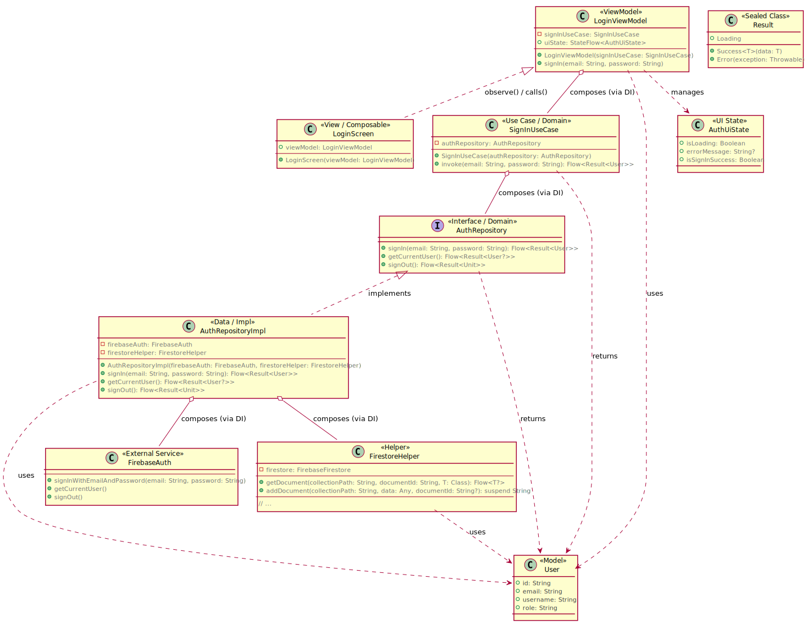
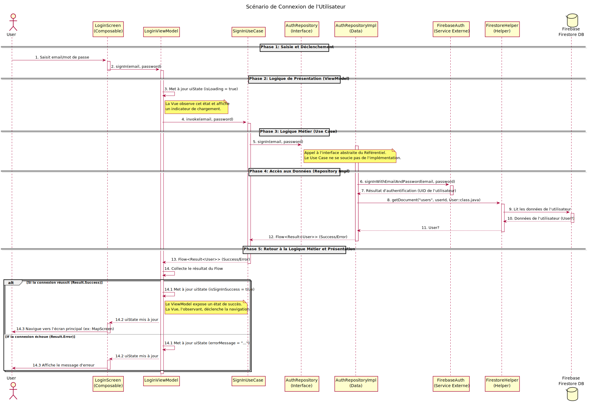
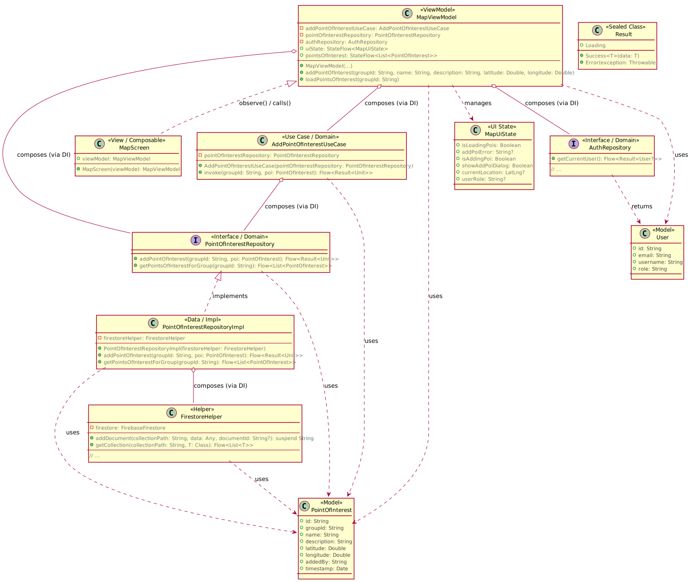
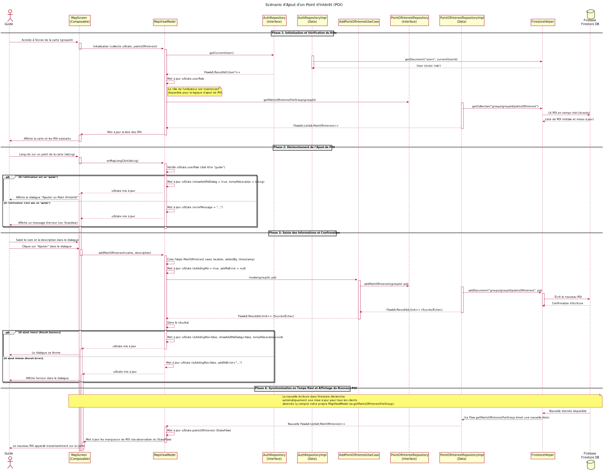

# GuideGroup - Documentation complète

Bienvenue dans la documentation complète de l'application GuideGroup.

---

## 📑 Table des matières

- [Introduction et vue d'ensemble de l'application GuideGroup](#introduction-et-vue-densemble-de-lapplication-guidegroup)
- [Architecture Logicielle : MVVM Multicouche et Injection de Dépendances](#architecture-logicielle--mvvm-multicouche-et-injection-de-dépendances)
- [Diagrammes d'utilisation uml](#diagrammes-dutilisation-uml)
- [Scénario connexion d'un Utilisateur](#scénario-connexion-dun-utilisateur)
- [Scénario envoi d'un message texte dans la messagerie de groupe](#scénario-envoi-dun-message-texte-dans-la-messagerie-de-groupe)
- [Scénario ajout d'un point d'Intérêt (POI) sur la carte](#scénario-ajout-dun-point-dintérêt-poi-sur-la-carte)

---

# Introduction et vue d'ensemble de l'application GuideGroup

## Introduction 

Ce document a pour objectif de fournir une description détaillée de l'application mobile \"GuideGroup\", conçue pour faciliter l'orientation et la communication au sein de groupes lors de déplacements, d'événements ou de visites.

L'application GuideGroup permet à des groupes de personnes qui se déplacent ensemble, de garder le contact, de partager des points d'intérêt et de \"chatter\" par un canal de communication unifié. Elle la gestion du groupe, la localisation en temps réel et la communication interactive.

Le code source de l'application est disponible sur github à l'adresse suivante : <https://github.com/easytoday/GuideGroup.git>.

## Objectifs et fonctionnalités clés de l'application

L'application GuideGroup offre plusieurs fonctionnalités, voici les principales :

### Gestion des groupes

Les utilisateurs peuvent créer des groupes, les rejoindre et les quitter. Chaque groupe est une entité distincte avec ses propres membres, son chat et ses points d'intérêt partagés.

-   **Création de Groupe :** Permet aux guides de démarrer de nouvelles sessions de groupe.

-   **Rejoindre un Groupe :** Les participants peuvent intégrer un groupe existant via un code unique.

-   **Gestion des Rôles :** Distinction claire entre les \"Guides\" (qui peuvent initier le suivi et ajouter des POI) et les \"Participants\".

### Localisation en temps réel

La localisation en temps réel est essentielle pour l'orientation et la sécurité du groupe.

-   **Suivi de Localisation :** Affichage en direct de la position de tous les membres du groupe sur une carte interactive. Cette fonctionnalité est activée et désactivée par le guide.

-   **Points d'Intérêt (POI) :** Les guides peuvent marquer des lieux significatifs sur la carte, visibles par tous les membres du groupe.

### Communication intégrée

Un canal de communication dédié pour chaque groupe afin de faciliter les échanges.

-   ****Chat de Groupe :**** Messagerie texte en temps réel entre tous les membres du groupe.

-   ****Partage de Médias :**** Possibilité d'envoyer des photos ou d'autres médias dans le chat pour enrichir la communication.

## Public Cible

GuideGroup permet d'aider les :

-   ****Guides touristiques et groupes de voyage :**** Pour maintenir la cohésion et l'orientation des participants.

-   ****Événements de groupe :**** Festivals, conférences, excursions où la localisation et la communication sont nécessaires.

-   ****Familles et amis :**** Pour les sorties en plein air, les randonnées ou les grands rassemblements.

## Aperçu des principales technologies utilisées

L'application GuideGroup est développée sur la plateforme Android, elle utilise principalement les technologies suivantes:

-   ****Langage de Programmation :**** Kotlin

-   ****Framework UI :**** Jetpack Compose (pour une UI moderne et déclarative)

-   ****Gestion de l'État et Architecture :**** MVVM (Model-View-ViewModel)

-   ****Injection de Dépendances :**** Hilt (basé sur Dagger 2, pour la gestion des dépendances)

-   ****Backend as a Service (BaaS) :**** Firebase (Authentication, Firestore, Storage) pour la gestion des utilisateurs, la base de données en temps réel et le stockage des fichiers.

-   ****Services de Cartographie :**** Google Maps Platform (pour l'affichage de la carte et la gestion de la localisation).

Le prochain chapitre aborde l'architecture de l'application GuideGroup.


---

# Architecture Logicielle : MVVM Multicouche et Injection de Dépendances

## Principes de l'architecture MVVM

L'application GuideGroup est bâtie sur l'architecture ****MVVM (Model-View-ViewModel)****, il s'agit d'un pattern de conception qui favorise une séparation claire des responsabilités, rendant le code plus maintenable, testable et évolutif.

### Le \"Model\" (M) : La Couche Données et Domaine

Dans notre implémentation MVVM, le \"Model\" est une couche étendue, englobant tout ce qui n'est ni l'interface utilisateur ni la logique de présentation directe. Elle se divise en deux sous-couches principales :

-   ****Couche Domaine (Domain Layer) :**** C'est le cœur de la logique métier de l'application. Elle contient les ****modèles de données**** (classes Kotlin comme 'User', 'Message', PointOfInterest), les ****Use Cases**** ) et les ****interfaces de Référentiels (Repositories)****.

    -   Les ****Use Cases**** encapsulent des opérations métier spécifiques (ex: SignInUseCase, SendMessageUseCase). Ils orchestrent les interactions avec les Référentiels pour réaliser une tâche métier complète. Ils sont indépendants de l'UI.

    -   Les ****interfaces de Référentiels**** définissent des contrats pour l'accès aux données (ex: AuthRepository, MessageRepository). Elles déclarent **ce que** les données peuvent faire, sans spécifier **comment** elles sont accédées ou stockées.

-   ****Couche Données (Data Layer) :**** Cette couche est responsable de l'implémentation concrète des interfaces de Référentiels définies dans la couche Domaine. Elle gère l'accès réel aux sources de données (bases de données locales, API réseau, services Firebase, etc.). Elle contient les implémentations des Référentiels (ex: AuthRepositoryImpl, MessageRepositoryImpl) et les sources de données qui interagissent directement avec les services externes.

    -   C'est par cette couche que l'application \"sait\" d'où proviennent les données. Le reste de l'application interagit via les interfaces de Référentiels.

### Le \"View\" (V) : L'Interface Utilisateur

La \"View\" est la couche responsable de l'affichage de l'interface utilisateur et de la capture des interactions de l'utilisateur.

-   Dans GuideGroup, la Vue est implémentée avec ****Jetpack Compose****. Il s'agit de fonctions '@Composable' qui décrivent l'UI.

-   La Vue est ****passive**** et \"sans intélligence\" dans le sens où elle ne contient aucune logique métier ou de manipulation de données. Son rôle principal est d'observer l'état exposé par le ViewModel et de déléguer les événements utilisateur au ViewModel.

-   Elle est découplée du Modèle ; elle ne connaît que le ViewModel.

### Le \"ViewModel\" (VM) : Le Pont entre Vue et Modèle

Le \"ViewModel\" agit comme un intermédiaire entre la Vue et le Modèle. C'est le cœur de la logique de présentation.

-   Il expose l'état de l'interface utilisateur sous une forme facilement consommable par la Vue (via des 'StateFlow' en Kotlin).

-   Il reçoit les événements de l'utilisateur de la Vue, traite la logique de présentation (ex: validation d'entrée, gestion des indicateurs de chargement), et appelle les Use Cases de la couche Domaine pour exécuter la logique métier.

-   Le ViewModel est ****indépendant à la Vue****. Il ne contient aucune référence directe à des éléments d'UI Android (Widgets, Composable spécifique). Cela le rend facilement testable en isolation, sans nécessiter d'interface graphique.

## Diagramme Architectural des Couches


Explication du diagramme architectural :

Flèches Pointillées (Dépendance) : indiquent qu'une couche dépend d'une autre. la flèche va du dépendant vers la dépendance. Par exemple, la view dépend du viewmodel.\
Flèche Solide Avec Triangle Creux (Implémentation) : indique qu'une classe implémente une interface. Par exemple repository implementations implémente repository interfaces.\
Flèche Solide Avec Losange (Composition/Agrégation) : non représenté directement ici car c'est un diagramme de couches, mais cela se manifeste au sein des couches (ex: viewmodel contient un use case).
Nuage (Cloud en anglais) : représente les services externes que l'application utilise (firebase, google maps).

## L'injection de dépendances avec hilt

L'injection de dépendances (di : dependency injection) est un principe de conception qui permet de fournir les dépendances d'un objet (autres objets dont il a besoin pour fonctionner) de l'extérieur, plutôt que de le laisser créer ses propres dépendances. Cela favorise le découplage, la testabilité et la flexibilité.

Dans guidegroup, nous utilisons hilt pour l'injection de dépendances sur android.

### Les avantages l'injection dépendance

****Découplage :**** Les classes ne créent pas leurs propres dépendances, elles les déclarent dans leur constructeur et hilt les fournit. Ainsi, un viewmodel ne sait pas comment un signinusecase est créé ; il sait juste qu'il en a besoin.\
****Testabilité :**** Lors des tests unitaires d'un viewmodel, on peut facilement lui fournir des \"faux\" (mocks ou fakes) use cases ou repositories qui simulent différents scénarios (succès, échec, données spécifiques), sans avoir besoin de véritables bases de données ou de connexions réseau.\
****Maintenabilité et évolutivité :**** Si l'on décide de changer l'implémentation d'un service (par exemple, passer de firebase à une autre base de données), seule l'implémentation du référentiel doit être modifiée. Les use cases et viewmodels n'ont pas besoin d'être touchés, car ils dépendent de l'interface et non de l'implémentation concrète.\
**Lisibilité du code :** Le code est plus clair car les dépendances sont explicitement déclarées dans le constructeur.

### annotation dans hilt

Hilt s'intègre au cycle de vie d'android et génère le code nécessaire à l'injection au moment de la compilation.

\@hiltandroidapp : cette annotation déclenche la génération du conteneur de dépendances de l'application.\
\@androidentrypoint : annoter les activités, fragments, vues, services, et broadcast receivers permet à hilt d'y injecter des dépendances.\
\@hiltviewmodel : est une annotation spécifique pour les viewmodels, qui les intègre dans le graphe de dépendances de hilt.\
\@inject : utilisé pour deux raisons principales :

-   sur le constructeur d'une classe (@inject constructor(...)) : indique à hilt comment créer une instance de cette classe en lui fournissant ses dépendances.

-   sur un champ ou une méthode : permet à hilt d'injecter une dépendance dans ce champ ou d'appeler cette méthode pour fournir une dépendance.\

\@module et \@provides : pour les cas où hilt ne peut pas directement \"savoir\" comment construire une dépendance (ex: interfaces, bibliothèques tierces comme firebaseauth). Un \@module est une classe qui fournit des dépendances. Les méthodes annotées avec \@provides à l'intérieur d'un module indiquent à hilt comment créer et fournir une instance d'un certain type.

Dans cet exemple, hilt saura comment fournir des instances de Firebaseauth, Firebasefirestore, Firebasestorage et surtout comment mapper l'interface du repository à son implémentation concrète.

Dans le chapitre 2 nous avons détaillé l'architecture mvvm et le principe d'utilisation de l'injection dépendance de hilt, avec un exemple de module.

Dans le chapitre 3, couvre les diagrammes d'utilisation uml et leurs descriptions détaillées.


---

# Diagrammes d'utilisation uml

## Diagrammes de cas d'utilisation

Les diagrammes de cas d'utilisation permettent modéliser les exigences fonctionnelles d'un système. ils décrivent :

-   ****Ce que le système fait :**** les fonctionnalités ou services qu'il offre.

-   ****Qui interagit avec le système :**** les acteurs (utilisateurs ou systèmes externes).

-   ****Comment les acteurs interagissent avec les fonctionnalités :**** les relations entre acteurs et cas d'utilisation.

Ils représentent une vue de haut niveau, sans s'attarder sur les détails d'implémentation.

## Identification des acteurs de guidegroup

Pour GuideGroup, nous avons identifié trois acteurs principaux qui interagissent avec le système :

-   **Utilisateur (user) :**
    C'est l'acteur de base et le plus générique. Il représente toute personne qui utilise l'application, qu'elle soit un guide ou un simple participant. Les cas d'utilisation associés à cet acteur sont des fonctionnalités universelles disponibles pour tous les utilisateurs.

-   **Guide :**
    Le \"guide\" est un type spécifique d'utilisateur avec des privilèges et responsabilités étendus. Un guide est généralement la personne qui initie et gère l'activité de groupe. Cet acteur hérite des capacités de l'utilisateur et en possède des spécifiques.

-   **Participant :**
    Le \"participant\" est l'autre type spécifique d'utilisateur. il rejoint un groupe créé par un guide et interagit principalement au sein de ce groupe. cet acteur hérite également des capacités de l'utilisateur et en possède des spécifiques.

## Diagramme de cas d'utilisation global de guidegroup

Ce diagramme offre une vue d'ensemble complète des interactions entre les acteurs et les fonctionnalités principales de l'application.


## Description Détaillée des Cas d'Utilisation

### Gestion des Comptes

**UC1** : S'inscrire\
Description : Permet à un nouvel utilisateur de créer un compte dans l'application en fournissant son email, mot de passe et un nom d'utilisateur. Il choisit également son rôle initial (Guide ou Participant).\
Acteurs : Utilisateur\
**UC2** : Se connecter\
Description : Permet à un utilisateur enregistré de s'authentifier pour accéder aux fonctionnalités de l'application.\
Acteurs : Utilisateur\
**UC3** : Se déconnecter
Description : Permet à un utilisateur de fermer sa session et de ne plus être connecté.
Acteurs : Utilisateur

### Gestion des Groupes

**UC4** : Créer un groupe\
Description : Permet à un guide de fonder un nouveau groupe, en lui attribuant un nom et une description. Un code unique est généré pour permettre aux participants de rejoindre.\
Acteurs : Guide\
**UC5** : Rejoindre un groupe\
Description : Permet à un participant de s'intégrer à un groupe existant en utilisant le code d'invitation fourni par le guide.\
Acteurs : Participant\
**UC6** : Quitter un groupe\
Description : Permet à un participant de se retirer volontairement d'un groupe auquel il appartient.\
Acteurs : Participant\
**UC7** : Voir la liste des groupes\
Description : Permet à l'utilisateur de consulter tous les groupes auxquels il est actuellement membre.\
Acteurs : Utilisateur\
**UC8** : Voir les détails d'un groupe\
Description : Permet à l'utilisateur d'accéder aux informations spécifiques d'un groupe, comme sa description, les membres actifs, etc.\
Acteurs : Utilisateur\

### Communication (Chat)

**UC9** : Envoyer un message texte\
Description : Permet à un participant d'envoyer un message textuel à l'ensemble des membres d'un groupe via le chat intégré.\
Acteurs : Participant\
Relation : Inclut Envoyer un message média (cette relation signifie que l'envoi de média fait partie du processus général d'envoi de message, ou est une extension de celui-ci).\
**UC10** : Envoyer un message média\
Description : Permet à un participant de partager des fichiers multimédias (photos, vidéos courtes, audio) dans le chat de groupe.\
Acteurs : Participant\
**UC11** : Voir l'historique du chat\
Description : Permet à l'utilisateur de consulter tous les messages précédemment envoyés et reçus dans un groupe spécifique.\
Acteurs : Utilisateur\

### Localisation et Cartographie

**UC12** : Voir sa localisation sur la carte\
Description : Permet à l'utilisateur de visualiser sa propre position géographique sur la carte interactive de l'application.\
Acteurs : Utilisateur\
**UC13** : Voir la localisation des membres du groupe\
Description : Permet à un participant de suivre en temps réel la position des autres membres de son groupe sur la carte.\
Acteurs : Participant\
**UC14** : Ajouter un point d'intérêt (POI)\
Description : Permet à un guide de marquer un emplacement spécifique sur la carte du groupe, en lui donnant un nom et une brève description, afin que tous les membres du groupe puissent le voir.\
Acteurs : Guide\
**UC15** : Voir les points d'intérêt\
Description : Permet à l'utilisateur de visualiser tous les points d'intérêt qui ont été ajoutés par les guides sur la carte du groupe.\
Acteurs : Utilisateur\
**UC16** : Démarrer le suivi de localisation\
Description : Permet à un guide d'activer le partage de la localisation en temps réel pour tous les membres du groupe, et de commencer lui-même à partager sa propre position.\
Acteurs : Guide\
**UC17** : Arrêter le suivi de localisation\
Description : Permet à un guide de désactiver le partage de la localisation en temps réel pour l'ensemble du groupe.\
Acteurs : Guide\
**UC18** : Gérer les permissions de localisation\
Description : Permet à l'utilisateur de gérer les autorisations de localisation nécessaires pour le fonctionnement de l'application (ex: autorisation d'accéder à la localisation en arrière-plan).\
Acteurs : Utilisateur\
Ce chapitre a fourni une vue d'ensemble de l'application GuideGroup. Le prochain chapitre commencera l'exploration des scénarios MVVM avec les diagrammes de séquence et les extraits de code (en annexe).


---

# Scénario connexion d'un Utilisateur

Ce chapitre est le premier d'une série d'études de cas détaillées qui décomposent des fonctionnalités clés de l'application GuideGroup. Pour chaque scénario, nous allons explorer :

-   Les classes impliquées à travers les différentes couches de l'architecture MVVM.

-   Un diagramme UML des classes pour visualiser les relations.

-   Une analyse détaillée du code pour chaque composant (Modèle, ViewModel, Vue).

-   Un diagramme de séquence UML pour illustrer la dynamique des interactions.

## Présentation du Scénario : Connexion d'un Utilisateur

Le scénario de connexion montre la manière dont l'application GuideGroup gère les identifiants de l'utilisateur, interagit avec un service d'authentification externe (Firebase Auth) et met à jour l'interface utilisateur en fonction du succès ou de l'échec de la connexion.

## Les Classes Impliquées dans le Scénario de Connexion

Nous allons nous concentrer sur les classes suivantes pour ce scénario :

-   ****'LoginScreen'**** : La ****Vue**** (Composable Jetpack Compose) qui affiche l'interface de connexion.

-   ****'LoginViewModel'**** : Le ****ViewModel**** qui gère l'état de l'UI de connexion et la logique de présentation.

-   ****'SignInUseCase'**** : Un ****UseCase**** de la couche Domaine qui encapsule la logique métier de l'authentification.

-   ****'AuthRepository'**** : L'****interface de Référentiel**** pour l'authentification, définissant le contrat.

-   ****'AuthRepositoryImpl'**** : L'****implémentation concrète**** du Référentiel, qui interagit avec Firebase.

-   ****'User'**** : Le ****modèle de données**** représentant un utilisateur de l'application.

-   ****'AuthUiState'**** : Un modèle d'état spécifique à l'UI de connexion, exposé par le ViewModel.

-   ****'Result'**** : Une classe scellée (sealed class) générique pour gérer les différents états d'une opération asynchrone (Loading, Success, Error).

-   ****'FirebaseAuth'**** : Le service externe de Firebase pour l'authentification.

-   ****'FirestoreHelper'**** : Une classe utilitaire pour interagir avec Firebase Firestore (pour récupérer le profil utilisateur après l'authentification).

## Diagramme UML des Classes du Scénario de Connexion

Ce diagramme UML de classes illustre les relations statiques entre les composants clés du scénario de connexion.

 


Explication du Diagramme :

La LoginScreen (Vue) observe et interagit avec le LoginViewModel.\
Le LoginViewModel dépend d'un SignInUseCase (injecté).\
Le SignInUseCase dépend de l'interface AuthRepository (injectée).\
L'implémentation concrète AuthRepositoryImpl implémente l'interface AuthRepository.\
AuthRepositoryImpl dépend des services externes FirebaseAuth et FirestoreHelper (injectés) pour la logique d'authentification et la récupération des données utilisateur.\
Les modèles de données comme User et l'état de l'UI AuthUiState sont utilisés à travers les couches pertinentes.\
La classe Result est une abstraction pour gérer les états des opérations asynchrones.

## Analyse Détaillée des Composants et du Code

Nous allons maintenant examiner le code de chaque composant, en commençant par les éléments du \"Modèle\" (couches Domaine et Données), puis le ViewModel, et enfin la Vue.

### Le Modèle (Couches Domaine et Données)

1.  User.kt (Modèle de Données)

    Rôle : Représente l'entité utilisateur. C'est un modèle simple et indépendant de toute source de données ou UI. Il est utilisé à travers toutes les couches.

2.  Result.kt (pour la Gestion des Résultats)

    Rôle : Une classe générique qui encapsule l'état d'une opération asynchrone (chargement en cours, succès de récupération des données, ou échec avec une exception). C'est une pratique courante pour la gestion des erreurs et des états dans les flux de données.

3.  AuthRepository.kt (Interface du Référentiel d'Authentification)

    Rôle : Définit le contrat pour toutes les opérations d'authentification et de gestion des utilisateurs. Cette interface fait partie de la couche Domaine. Le reste de l'application interagit avec l'authentification uniquement via cette interface, garantissant le découplage.

4.  AuthRepositoryImpl.kt (Implémentation du Référentiel d'Authentification)

    Rôle : Cette classe fait partie de la couche Données. Elle implémente AuthRepository et contient la logique concrète pour interagir avec Firebase Authentication (firebaseAuth) pour se connecter ou s'inscrire, et avec Firebase Firestore (firestoreHelper) pour stocker/récupérer les profils utilisateurs.
    Grâce à l'architecture MVVM : cette classe isole la complexité des API Firebase des couches supérieures. Grâce à Hilt, FirebaseAuth et FirestoreHelper sont injectés, rendant AuthRepositoryImpl facile à tester en remplaçant ces dépendances par des mocks.

5.  SignInUseCase.kt (Use Case d'Authentification)

    Rôle : Fait partie de la couche Domaine. Ce Use Case encapsule la logique métier \"Se connecter\". Il dépend de l'interface AuthRepository.
    Grâce à l'architecture MVVM : Il sépare la logique métier de la logique de présentation (dans le ViewModel). Un ViewModel ne devrait pas directement appeler un Repository. Le Use Case agit comme un orchestrateur d'opérations métier, et rend le ViewModel plus léger.

### Le ViewModel (Couche Présentation)

1.  AuthUiState.kt (Modèle d'État UI)

    Rôle : Un simple Data Class qui représente l'état actuel de l'interface utilisateur de l'écran de connexion. Le ViewModel mettra à jour cet état, et la Vue l'observera pour réagir en conséquence (afficher un indicateur de chargement, un message d'erreur, ou naviguer).

2.  LoginViewModel.kt (ViewModel)
    Rôle : Fait partie de la couche Présentation. Le LoginViewModel est le lien entre la LoginScreen et la logique métier d'authentification.
    Il expose un StateFlow\<AuthUiState\> (uiState) que la Vue observe pour réagir aux changements d'état (chargement, succès, erreur).
    La méthode signIn() est appelée par la Vue. Elle déclenche la logique d'authentification en appelant le SignInUseCase.
    Il traite les résultats du UseCase (Result.Success ou Result.Error) et met à jour l'état de l'UI en conséquence.
    Grâce à l'architecture MVVM : Il ne contient aucune logique d'UI Android, ce qui le rend indépendant de la plateforme et facile à tester (sans émulateur). Il gère l'état de la Vue.

### La Vue (Couche Présentation)

1.  LoginScreen.kt (Composable Jetpack Compose)

    Rôle : C'est la Vue concrète de notre architecture. Elle fait partie de la couche Présentation.
    Elle observe les StateFlow exposés par le LoginViewModel (uiState) pour se reconstruire automatiquement lorsque l'état change (ex: afficher/cacher un spinner de chargement, afficher un message d'erreur).
    Elle ne contient aucune logique métier. Lorsqu'un utilisateur clique sur \"Se connecter\", elle appelle simplement la méthode signIn du LoginViewModel, lui déléguant la responsabilité.
    hiltViewModel() est utilisé ici pour que Hilt fournisse l'instance correcte du LoginViewModel.
    collectAsStateWithLifecycle() est une fonction Jetpack Compose qui collecte le StateFlow en tenant compte du cycle de vie du Composable, évitant les fuites de mémoire.
    LaunchedEffect est utilisé pour déclencher des effets de bord (comme la navigation) en réaction aux changements d'état du ViewModel (ici, uiState.isSignInSuccess).

## Diagramme de Séquence UML : Scénario de Connexion Utilisateur

Ce diagramme visualise le flux dynamique des interactions entre les composants de l'application GuideGroup lors du processus de connexion.



Explication Détaillée des Étapes du Diagramme :

Utilisateur -\> LoginScreen (Vue) : L'utilisateur interagit avec l'interface graphique en saisissant ses identifiants (email, mot de passe) et en cliquant sur le bouton de connexion.\
LoginScreen -\> LoginViewModel : La Vue, étant \"passive\", délègue l'action à son LoginViewModel en appelant la méthode signIn(email, password).\
LoginViewModel -\> LoginViewModel : Le ViewModel reçoit l'action. Sa première responsabilité est de gérer l'état de l'UI. Il met à jour un StateFlow interne (~uiState~) pour indiquer que l'opération de connexion est en cours (isLoading = true). La Vue, qui observe ce StateFlow, réagit immédiatement en affichant un indicateur de chargement et en désactivant le bouton de connexion.\
LoginViewModel -\> SignInUseCase : Le ViewModel, qui ne gère pas la logique métier complexe, appelle le SignInUseCase (un composant de la couche Domaine) pour exécuter l'opération de connexion.\
SignInUseCase -\> AuthRepository (Interface) : Le SignInUseCase appelle la méthode signIn sur l'interface AuthRepository. Il ne se soucie pas de l'implémentation concrète.\
AuthRepositoryImpl -\> FirebaseAuth : L'implémentation concrète du référentiel (AuthRepositoryImpl) utilise l'API de Firebase Authentication (FirebaseAuth) pour tenter d'authentifier l'utilisateur.\
FirebaseAuth --\> AuthRepositoryImpl : Firebase renvoie le résultat de l'authentification (succès ou échec, et si succès, l'UID de l'utilisateur).\
AuthRepositoryImpl -\> FirestoreHelper : Si l'authentification Firebase réussit, AuthRepositoryImpl utilise le FirestoreHelper pour récupérer le profil complet de l'utilisateur (User model) depuis Firebase Firestore, car FirebaseAuth ne fournit que des informations d'authentification de base.\
FirestoreHelper -\> Firebase Firestore DB : Le FirestoreHelper interagit avec la base de données Firestore pour lire le document utilisateur.\
Firebase Firestore DB --\> FirestoreHelper : La base de données renvoie les données du profil utilisateur.\
FirestoreHelper --\> AuthRepositoryImpl : Le FirestoreHelper renvoie le profil utilisateur à l'implémentation du référentiel.\
AuthRepositoryImpl --\> SignInUseCase : L'AuthRepositoryImpl encapsule le résultat (succès avec l'objet User, ou erreur) dans un Flow\<Result\<User\>\> et le renvoie au SignInUseCase.\
SignInUseCase --\> LoginViewModel : Le SignInUseCase transmet le Flow\<Result\<User\>\> au LoginViewModel.\
LoginViewModel -\> LoginViewModel (Collecte du Flow) : Le LoginViewModel collecte le Flow et réagit à son émission :
Si Result.Success : Le ViewModel met à jour son uiState pour indiquer le succès (isSignInSuccess = true).\
Si Result.Error : Le ViewModel met à jour son uiState pour inclure le message d'erreur (errorMessage = \"...\").\
LoginViewModel --\> LoginScreen : Le StateFlow uiState du ViewModel est mis à jour, ce que la Vue observe.\
LoginScreen -\> Utilisateur :
Si succès : La Vue détecte isSignInSuccess = true via son LaunchedEffect et déclenche la navigation vers l'écran principal.\
Si échec : La Vue détecte errorMessage non nul et affiche le message d'erreur à l'utilisateur.\
Ce scénario de connexion illustre parfaitement la séparation des responsabilités de MVVM et l'efficacité de l'injection de dépendances pour construire un flux de travail robuste et maintenable.\
Le Chapitre 4. a détaillé le scénario de connexion, Le Chapitre 5, expose le scénario d'envoi de message.


---

# Scénario envoi d'un message texte dans la messagerie de groupe

Ce chapitre se concentre sur l'une des fonctionnalités de communication clés de GuideGroup : le chat de groupe. Nous allons analyser le flux d'envoi d'un message texte, depuis l'interaction utilisateur jusqu'à la persistance des données et la mise à jour en temps réel de l'UI.

## Présentation du Scénario : Envoi d'un Message Texte

L'envoi d'un message dans le chat de groupe est une interaction dynamique qui implique l'authentification de l'expéditeur, l'enregistrement du message dans une base de données en temps réel (Firebase Firestore) et la diffusion quasi-instantanée à tous les membres du groupe. Ce scénario met en lumière la gestion des événements UI et la propagation des données à travers l'architecture.

## Les Classes Impliquées dans le Scénario d'Envoi de Message

Pour ce scénario, les classes clés à examiner sont :

-   ****'ChatScreen'**** : La ****Vue**** (Composable Jetpack Compose) qui affiche l'interface du chat et gère la saisie de message.

-   ****'ChatViewModel'**** : Le ****ViewModel**** qui gère l'état de l'UI du chat et orchestre l'envoi/la réception des messages.

-   ****'SendMessageUseCase'**** : Un ****UseCase**** de la couche Domaine pour encapsuler la logique d'envoi de message.

-   ****'MessageRepository'**** : L'****interface de Référentiel**** pour les messages, définissant le contrat d'accès aux données.

-   ****'MessageRepositoryImpl'**** : L'****implémentation concrète**** du Référentiel, interagit avec Firebase Firestore et Storage.

-   ****'AuthRepository'**** : L'interface de Référentiel pour l'authentification, utilisée ici pour récupérer l'utilisateur courant (expéditeur).

-   ****'Message'**** : Le ****modèle de données**** représentant un message de chat.

-   ****'User'**** : Le modèle de données de l'utilisateur (pour les infos de l'expéditeur).

-   ****'ChatUiState'**** : Un modèle d'état spécifique à l'UI du chat, exposé par le ViewModel.

-   ****'Result'**** : La classe scellée générique pour la gestion des résultats d'opération.

-   ****'FirestoreHelper'**** : Une classe utilitaire pour interagir avec Firebase Firestore.

-   ****'FirebaseStorage'**** : Le service externe de Firebase pour le stockage de fichiers (pour les médias, bien que ce scénario se concentre sur le texte, la structure de 'MessageRepositoryImpl' l'anticipe).

## Diagramme UML des Classes du Scénario d'Envoi de Message

Ce diagramme UML de classes montre les relations directes entre les composants clés du scénario d'envoi de message.

Explication du Diagramme :

La ChatScreen observe le ChatViewModel.
Le ChatViewModel compose un SendMessageUseCase (pour l'envoi) et un AuthRepository (pour obtenir l'utilisateur courant, l'expéditeur du message).
Le SendMessageUseCase compose le MessageRepository (l'interface).
MessageRepositoryImpl implémente MessageRepository et utilise FirestoreHelper pour écrire les données et potentiellement FirebaseStorage si des médias sont envoyés.
Message est le modèle de données central pour les messages.
ChatUiState et User sont les modèles d'état UI et de données utilisés par le ViewModel.

## Analyse Détaillée des Composants et du Code

### Le Modèle (Couches Domaine et Données)

1.  Message.kt (Modèle de Données)

    Rôle : Représente la structure d'un message de chat. Il inclut des champs pour l'expéditeur, le contenu (texte ou URL média), le type de média et l'horodatage. Ce modèle est indépendant de la source de données et de l'UI.

2.  MessageRepository.kt (Interface du Référentiel de Messages)

    Rôle : Définit les opérations possibles liées aux messages, comme envoyer un message, récupérer tous les messages d'un groupe ou téléverser un média. C'est le contrat de la couche Domaine.

3.  MessageRepositoryImpl.kt (Implémentation du Référentiel de Messages)

    Rôle : L'implémentation concrète de la couche Données. Elle gère l'interaction directe avec Firebase Firestore (pour le texte) et Firebase Storage (pour les médias). Le getMessagesForGroup utilise la capacité de Firestore à émettre des mises à jour en temps réel via un Flow, ce qui est nécessaire pour le chat.

4.  SendMessageUseCase.kt (Use Case d'Envoi de Message)

    Rôle : Ce Use Case, de la couche Domaine, encapsule la logique métier \"Envoyer un message\". Il reçoit le message à envoyer et le délègue au MessageRepository. Il est indépendant à l'UI et à la persistance.

### Le ViewModel (Couche Présentation)

1.  ChatUiState.kt (Modèle d'État UI)

    Rôle : Représente l'état spécifique de l'interface utilisateur de l'écran de chat. Le ChatViewModel met à jour cet état, et la ChatScreen l'observe pour adapter son affichage (par exemple, afficher un indicateur de chargement ou un message d'erreur).

2.  ChatViewModel.kt (ViewModel)

    Rôle : Fait partie de la couche Présentation. Le ChatViewModel est le gestionnaire de la logique de présentation pour l'écran de chat.
    Il expose deux StateFlow : uiState (pour les erreurs, le chargement, etc.) et messages (pour la liste des messages à afficher).
    La méthode loadCurrentUser() récupère les informations de l'utilisateur actuel via AuthRepository pour identifier l'expéditeur des messages.
    La méthode loadMessages() observe un Flow du MessageRepository qui émet les messages en temps réel depuis Firestore. Cela garantit que le chat est toujours à jour pour l'utilisateur.
    La méthode sendMessage() est appelée par la Vue. Elle construit l'objet Message avec les informations de l'expéditeur et le texte, puis délègue l'envoi au SendMessageUseCase.
    Il gère les résultats de l'envoi et met à jour uiState en cas d'erreur.

### La Vue (Couche Présentation)

1.  ChatScreen.kt (Composable Jetpack Compose)

    Rôle : C'est la Vue concrète de l'architecture. Elle fait partie de la couche Présentation.
    Elle est responsable de l'affichage de l'interface utilisateur du chat : la barre de saisie, le bouton d'envoi, et la liste des messages.
    Elle observe les StateFlow (uiState et messages) du ChatViewModel pour que son affichage soit automatiquement mis à jour lorsque de nouveaux messages arrivent ou que l'état de l'UI change (chargement, erreur).
    Elle délègue les interactions utilisateur (clic sur \"Envoyer\") au ChatViewModel via la méthode viewModel.sendMessage().
    Elle ne contient aucune logique métier ni d'accès direct aux données.

## Diagramme de Séquence UML : Scénario d'Envoi d'un Message Texte

Ce diagramme visualise le flux dynamique lors de l'envoi d'un message dans le chat.

Explication Détaillée des Étapes du Diagramme :

**Phase 1: Initialisation**

Utilisateur -\> ChatScreen : L'utilisateur navigue vers l'écran de chat d'un groupe spécifique.\
ChatScreen -\> ChatViewModel : Lors de son initialisation, la ChatScreen commence à observer les StateFlow (uiState et messages) du ChatViewModel.\
ChatViewModel -\> AuthRepository (Interface) : Le ChatViewModel récupère les informations de l'utilisateur courant (ID et nom) via AuthRepository.getCurrentUser() pour marquer les messages de l'expéditeur et les distinguer.\
AuthRepositoryImpl -\> FirestoreHelper -\> Firebase Firestore DB : L'implémentation du référentiel d'authentification accède à Firestore pour récupérer le profil utilisateur.\
Firebase Firestore DB --\> AuthRepositoryImpl --\> ChatViewModel : Le profil utilisateur est renvoyé au ViewModel.\
ChatViewModel -\> ChatViewModel : Le ViewModel met à jour uiState.currentUserName et currentUserId.\
ChatViewModel -\> MessageRepository (Interface) : Le ViewModel initie également le chargement des messages du groupe en appelant MessageRepository.getMessagesForGroup().\
MessageRepositoryImpl -\> FirestoreHelper -\> Firebase Firestore DB : L'implémentation du référentiel de messages établit une écoute en temps réel sur la collection de messages du groupe dans Firestore.\
Firebase Firestore DB --\> FirestoreHelper --\> MessageRepositoryImpl --\> ChatViewModel : Firestore renvoie continuellement des listes de messages mises à jour via un Flow au ViewModel.\
ChatViewModel -\> ChatScreen : Le ViewModel met à jour son \_messages StateFlow, ce qui déclenche la recomposition de la ChatScreen et l'affichage des messages.\
**Phase 2: Saisie et Envoi du Message**

Utilisateur -\> ChatScreen : L'utilisateur saisit son message dans le champ de texte et clique sur le bouton \"Envoyer\".\
ChatScreen -\> ChatViewModel : La ChatScreen appelle ChatViewModel.sendMessage(text) avec le contenu du message\
.
ChatViewModel -\> ChatViewModel : Le ViewModel valide le message (non vide) et crée un objet Message complet avec l'ID et le nom de l'expéditeur récupérés précédemment, ainsi qu'un ID unique généré pour le message. Il met à jour uiState pour effacer toute erreur précédente.\
ChatViewModel -\> SendMessageUseCase : Le ViewModel délègue l'opération d'envoi au SendMessageUseCase.\
SendMessageUseCase -\> MessageRepository (Interface) : Le Use Case appelle MessageRepository.sendMessage() sur l'interface.\
MessageRepositoryImpl -\> FirestoreHelper -\> Firebase Firestore DB : L'implémentation concrète du référentiel utilise FirestoreHelper pour écrire le nouvel objet Message dans la collection Firestore groups/groupId/messages.\
Firebase Firestore DB --\> FirestoreHelper --\> MessageRepositoryImpl --\> SendMessageUseCase --\> ChatViewModel : Le résultat de l'opération d'écriture (succès ou échec) est renvoyé sous forme de Flow\<Result\<Unit\>\> et propagé jusqu'au ViewModel.\
ChatViewModel -\> ChatViewModel : Le ViewModel collecte le Flow et, en cas d'erreur, met à jour uiState.sendMessageError pour l'afficher à l'utilisateur. En cas de succès, aucune action spécifique n'est nécessaire pour mettre à jour la liste des messages, car le mécanisme de synchronisation en temps réel s'en chargera.\
**Phase 3: Synchronisation en Temps Réel et Affichage**

Firebase Firestore DB -\> FirestoreHelper -\> MessageRepositoryImpl : Dès que le nouveau message est écrit dans Firestore, la \"listener\" (écouteur en temps réel) établie par getMessagesForGroup() détecte ce changement et envoie une nouvelle liste de messages mise à jour.
MessageRepositoryImpl --\> ChatViewModel : Le Flow\<List\<Message\>\> émet cette nouvelle liste au ChatViewModel.\
ChatViewModel -\> ChatScreen : Le ChatViewModel met à jour son \_messages StateFlow avec la nouvelle liste, ce qui déclenche la recomposition de la ChatScreen.\
ChatScreen -\> Utilisateur : La ChatScreen se met à jour et le nouveau message apparaît instantanément dans la liste des messages pour l'utilisateur qui l'a envoyé, et pour tous les autres membres du groupe qui regardent également le chat.\
Ce scénario met en évidence tout l'intérêt de l'architecture MVVM combinée à une base de données en temps réel. La Vue est simple, le ViewModel gère la logique de présentation et la coordination, et les couches Domaine/Données s'occupent de la complexité métier et de l'accès aux données.

Le Chapitre 6 traite du scenario de l'ajout d'un Point d'Intérêt sur la Carte.


---

# Scénario ajout d'un point d'Intérêt (POI) sur la carte

Ce chapitre explore la fonctionnalité permettant d'ajouter un point d'intérêt sur la carte d'un groupe. Ce scénario met en lumière comment l'application gère l'interaction avec la carte et la persistance de données géospatiales.

## Présentation du Scénario : Ajout d'un Point d'Intérêt (POI)

Lors d'une excursion ou d'une visite, un guide peut souhaiter marquer des lieux significatifs (points de rencontre, sites d'intérêt, dangers potentiels). L'application GuideGroup permet d'ajouter ces \"Points d'Intérêt\" (POI) sur la carte du groupe, les rendant visibles par tous les participants. Ce scénario implique la détection d'une interaction cartographique, la collecte d'informations sur le POI, et son enregistrement.

## Les Classes Impliquées dans le Scénario d'Ajout de POI

Les classes principales impliquées dans ce scénario sont :

-   ****'MapScreen'**** : La ****Vue**** (Composable Jetpack Compose) qui affiche la carte et gère les interactions (long-clic pour ajouter un POI).

-   ****'MapViewModel'**** : Le ****ViewModel**** qui gère l'état de l'UI de la carte, y compris l'affichage des POI existants et le déclenchement de l'ajout de nouveaux.

-   ****'AddPointOfInterestUseCase'**** : Un ****UseCase**** de la couche Domaine qui encapsule la logique d'ajout d'un POI.

-   ****'PointOfInterestRepository'**** : L'****interface de Référentiel**** pour les POI, définissant le contrat d'accès aux données.

-   ****'PointOfInterestRepositoryImpl'**** : L'****implémentation concrète**** du Référentiel, qui interagit avec Firebase Firestore.

-   ****'AuthRepository'**** : L'interface de Référentiel pour l'authentification, utilisée pour vérifier le rôle de l'utilisateur (doit être un guide) et obtenir son ID.

-   ****'PointOfInterest'**** : Le ****modèle de données**** représentant un point d'intérêt.

-   ****'MapUiState'**** : Un modèle d'état spécifique à l'UI de la carte, exposé par le ViewModel, incluant potentiellement l'état d'un dialogue d'ajout de POI.

-   ****'Result'**** : La classe scellée générique pour la gestion des résultats d'opération.

-   ****'FirestoreHelper'**** : Une classe utilitaire pour interagir avec Firebase Firestore.

## Diagramme UML des Classes du Scénario d'Ajout de POI

Ce diagramme UML de classes illustre les relations statiques entre les composants clés du scénario d'ajout de POI.



****Explication du Diagramme :****

-   La ****'MapScreen'**** (Vue) interagit avec le ****'MapViewModel'**** pour afficher la carte et les POI, et pour déclencher l'ajout d'un nouveau POI.

-   Le ****'MapViewModel'**** dépend d'un ****'AddPointOfInterestUseCase'**** pour la logique d'ajout, d'un ****'PointOfInterestRepository'**** pour la gestion des POI existants, et d'un ****'AuthRepository'**** pour obtenir le rôle de l'utilisateur.

-   Le ****'AddPointOfInterestUseCase'**** dépend de l'interface ****'PointOfInterestRepository'****.

-   L'implémentation concrète ****'PointOfInterestRepositoryImpl'**** gère la persistance des POI via ****'FirestoreHelper'**** dans Firebase Firestore.

-   Le ****'PointOfInterest'**** est le modèle de données central pour les POI.

-   ****'MapUiState'**** est le modèle d'état UI spécifique à l'écran de la carte.

## Analyse Détaillée des Composants et du Code

### Le Modèle (Couches Domaine et Données)

1.  PointOfInterest.kt (Modèle de Données)

    -   ****Rôle :**** Représente une entité de point d'intérêt. Elle contient des informations telles que les coordonnées géographiques, le nom, la description, l'ID du groupe, l'ID de l'utilisateur qui l'a ajouté, et l'horodatage. Ce modèle est indépendant de la source de données et de l'UI.

2.  PointOfInterestRepository.kt (Interface du Référentiel de POI)

    -   ****Rôle :**** Définit le contrat pour toutes les opérations CRUD (Create, Read, Update, Delete) liées aux points d'intérêt. Cette interface fait partie de la ****couche Domaine****. Le reste de l'application interagit avec les POI **uniquement** via cette interface.

3.  PointOfInterestRepositoryImpl.kt (Implémentation du Référentiel de POI)

    -   ****Rôle :**** Cette classe fait partie de la ****couche Données****. Elle implémente PointOfInterestRepository et contient la logique concrète pour interagir avec ****Firebase Firestore**** via firestoreHelper pour ajouter ou récupérer les POI. Le getPointsOfInterestForGroup utilise la capacité de Firestore à émettre des mises à jour en temps réel via un 'Flow', assurant que les POI s'affichent instantanément.

4.  AddPointOfInterestUseCase.kt (Use Case d'Ajout de POI)

    -   ****Rôle :**** Fait partie de la ****couche Domaine****. Ce Use Case encapsule la logique métier \"Ajouter un point d'intérêt\". Il dépend de l'interface PointOfInterestRepository.

### Le ViewModel (Couche Présentation)

1.  MapUiState.kt (Modèle d'État UI pour la Carte)

    Rôle : Représente l'état complexe de l'interface utilisateur de l'écran de la carte. Il inclut les localisations, les POI, les états de chargement, les messages d'erreur et des indicateurs pour l'interaction avec le dialogue d'ajout de POI.

2.  MapViewModel.kt (Extrait pertinent pour l'ajout de POI)

    Rôle : Fait partie de la couche Présentation. Le MapViewModel gère la logique de présentation pour l'écran de la carte.
    Il expose un StateFlow\<MapUiState\> (uiState) que la Vue observe pour réagir aux changements d'état (affichage du dialogue d'ajout de POI, erreurs, chargement).
    loadUserRole() : Récupère le rôle de l'utilisateur pour déterminer si l'ajout de POI est autorisé.
    onMapLongClick(latLng: LatLng) : Cette fonction est appelée par la Vue lorsqu'un long-clic est détecté sur la carte. Si l'utilisateur est un guide, elle met à jour l'état pour afficher un dialogue de saisie d'informations pour le POI.
    addPointOfInterest(name: String, description: String) : Cette fonction est appelée par la Vue lorsque le guide confirme l'ajout du POI. Elle construit l'objet PointOfInterest et le délègue au AddPointOfInterestUseCase.
    loadPointsOfInterest() : Observe les POI existants du PointOfInterestRepository en temps réel pour les afficher sur la carte.

### La Vue (Couche Présentation)

1.  MapScreen.kt (Extrait pertinent pour l'ajout de POI)

    Rôle : C'est la Vue concrète de notre architecture pour l'écran de la carte. Elle fait partie de la couche Présentation.\
    Elle affiche la carte Google Maps et est responsable de la gestion des interactions utilisateur spécifiques à la carte, comme le long-clic.\
    Le paramètre onMapLongClick de GoogleMap est configuré pour appeler viewModel.onMapLongClick(latLng), déléguant la gestion de l'événement au ViewModel.\
    Elle observe les StateFlow (uiState) du MapViewModel pour :\
    Afficher les marqueurs des POI (uiState.pointsOfInterest).\
    Contrôler l'affichage du dialogue d'ajout de POI (uiState.showAddPoiDialog).\
    Afficher les messages d'erreur (uiState.errorMessage, uiState.addPoiError).\
    Gérer l'état de chargement du dialogue (uiState.isAddingPoi).\
    Le AddPointOfInterestDialog est un composable séparé qui collecte les informations du POI et délègue l'action de confirmation à viewModel.addPointOfInterest().

## Diagramme de Séquence UML : Scénario d'ajout d'un Point d'Intérêt

Ce diagramme visualise le flux dynamique des interactions lors de l'ajout d'un point d'intérêt.



Explication Détaillée des Étapes du Diagramme :

**Phase 1: Initialisation et Vérification du Rôle**

Utilisateur -\> MapScreen : L'utilisateur accède à l'écran de la carte pour un groupe spécifique.\
MapScreen -\> MapViewModel : La MapScreen s'initialise et commence à observer les StateFlow du MapViewModel (uiState et pointsOfInterest).\
MapViewModel -\> AuthRepository (Interface) : Le MapViewModel demande le profil de l'utilisateur courant pour déterminer son rôle (guide ou participant). Cela est crucial pour autoriser ou non l'ajout de POI.\
AuthRepositoryImpl -\> FirestoreHelper -\> Firebase Firestore DB : L'implémentation du référentiel d'authentification interagit avec Firestore pour obtenir les détails du profil utilisateur.\
Firebase Firestore DB --\> AuthRepositoryImpl --\> MapViewModel : Le rôle de l'utilisateur est renvoyé au ViewModel.\
MapViewModel -\> MapViewModel : Le ViewModel met à jour uiState.userRole afin que la Vue puisse adapter son comportement (ex: désactiver l'action de long-clic si l'utilisateur n'est pas un guide).\
MapViewModel -\> PointOfInterestRepository (Interface) : Le ViewModel initie également le chargement des POI existants du groupe en appelant PointOfInterestRepository.getPointsOfInterestForGroup().\
PointOfInterestRepositoryImpl -\> FirestoreHelper -\> Firebase Firestore DB : L'implémentation du référentiel de POI établit une écoute en temps réel sur la collection pointsOfInterest du groupe dans Firestore.\
Firebase Firestore DB --\> FirestoreHelper --\> PointOfInterestRepositoryImpl --\> MapViewModel : Firestore renvoie continuellement des listes de POI mises à jour via un Flow au ViewModel.\
MapViewModel -\> MapScreen : Le ViewModel met à jour uiState.pointsOfInterest, ce qui déclenche la recomposition de la MapScreen et l'affichage des marqueurs des POI existants sur la carte.

**Phase 2: Déclenchement de l'Ajout de POI**

Utilisateur -\> MapScreen : L'utilisateur effectue un long-clic sur un point de la carte où il souhaite ajouter un POI. Les coordonnées (latLng) de ce point sont capturées.\
MapScreen -\> MapViewModel : La MapScreen appelle la méthode onMapLongClick(latLng) du MapViewModel, lui passant les coordonnées.\
MapViewModel -\> MapViewModel : Le ViewModel vérifie le userRole dans son uiState.\
Si userRole est \"guide\" : Le ViewModel met à jour son uiState pour activer l'affichage du dialogue d'ajout de POI (showAddPoiDialog = true) et stocke temporairement les coordonnées du POI (tempPoiLocation = latLng).\
Si userRole n'est pas \"guide\" : Le ViewModel met à jour son uiState pour afficher un message d'erreur (ex: via un Snackbar) indiquant que seuls les guides peuvent ajouter des POI.\
MapViewModel --\> MapScreen : L'état uiState est mis à jour, ce qui déclenche la recomposition de la MapScreen.\
MapScreen -\> Utilisateur : Si l'utilisateur est un guide, la MapScreen affiche le dialogue \"Ajouter un Point d'Intérêt\", invitant l'utilisateur à saisir le nom et la description du POI.

**Phase 3: Saisie des Informations et Confirmation**

Utilisateur -\> MapScreen : L'utilisateur saisit le nom et la description dans le dialogue et clique sur le bouton \"Ajouter\".\
MapScreen -\> MapViewModel : La MapScreen appelle la méthode addPointOfInterest(name, description) du MapViewModel, lui passant les informations saisies.\
MapViewModel -\> MapViewModel : Le ViewModel construit un objet PointOfInterest complet, en utilisant les coordonnées temporaires stockées (tempPoiLocation), l'ID de l'utilisateur courant (currentUserId), le nom, la description et un ID unique généré. Il met à jour uiState pour indiquer que l'ajout est en cours (isAddingPoi = true) et effacer les erreurs précédentes.\
MapViewModel -\> AddPointOfInterestUseCase : Le ViewModel délègue l'opération d'ajout au AddPointOfInterestUseCase.\
AddPointOfInterestUseCase -\> PointOfInterestRepository (Interface) : Le Use Case appelle la méthode addPointOfInterest() sur l'interface du référentiel.\
PointOfInterestRepositoryImpl -\> FirestoreHelper -\> Firebase Firestore DB : L'implémentation concrète du référentiel utilise FirestoreHelper pour écrire le nouvel objet PointOfInterest dans la collection Firestore groups/groupId/pointsOfInterest.\
Firebase Firestore DB --\> FirestoreHelper --\> PointOfInterestRepositoryImpl --\> AddPointOfInterestUseCase --\> MapViewModel : Le résultat de l'opération d'écriture (succès ou échec) est renvoyé sous forme de Flow\<Result\<Unit\>\> et propagé jusqu'au ViewModel.\
MapViewModel -\> MapViewModel : Le ViewModel collecte le Flow et gère le résultat :\
Si Result.Success : Le ViewModel met à jour uiState pour fermer le dialogue (showAddPoiDialog = false) et désactiver l'état de chargement (isAddingPoi = false).\
Si Result.Error : Le ViewModel met à jour uiState pour inclure le message d'erreur (addPoiError = \"...\"), qui sera affiché dans le dialogue.\
MapViewModel --\> MapScreen : L'état uiState est mis à jour, ce qui déclenche la recomposition de la MapScreen.\
MapScreen -\> Utilisateur : Si l'ajout a réussi, le dialogue se ferme. Si une erreur est survenue, le message d'erreur est affiché dans le dialogue.

**Phase 4: Synchronisation en Temps Réel et Affichage du Nouveau POI**

Firebase Firestore DB -\> FirestoreHelper -\> PointOfInterestRepositoryImpl : Dès que le nouveau POI est écrit dans Firestore, la \"listener\" (écouteur en temps réel) établie par getPointsOfInterestForGroup() détecte ce changement et envoie une nouvelle liste de POI mise à jour.\
PointOfInterestRepositoryImpl --\> MapViewModel : Le Flow\<List\<PointOfInterest\>\> émet cette nouvelle liste au MapViewModel.\
MapViewModel -\> MapScreen : Le MapViewModel met à jour son uiState.pointsOfInterest StateFlow avec la nouvelle liste, ce qui déclenche la recomposition de la MapScreen.\
MapScreen -\> Utilisateur : La MapScreen se met à jour et le nouveau marqueur du POI apparaît instantanément sur la carte pour l'utilisateur qui l'a ajouté, et pour tous les autres membres du groupe qui regardent également la carte.\
Ce scénario met en évidence la robustesse de l'architecture MVVM pour gérer les interactions complexes d'UI, la validation des rôles, et la persistance des données en temps réel.\
Le Chapitre 6 marque la fin de l'étude de trois scénarios clés avec leurs diagrammes de classes, code et diagrammes de séquence détaillés.

---

# Conclusion

## Conclusion

Dans ce document nous avons d'abord présenté au chapitre 1, l'application les fonctionnalités prncipales ainsi que les téchnologies utilisées pour sa conception. Nous sommes ensuite entré dans le coeur de son fonctionnement : dans le chapitre 2 nous avons présenté l'architecture MVVM (Model View View Model) composé des couches donées et domaine, interface utilisateur et ViewModel pour faire le pont entre les deux premières couches. Nous avons également mis l'accent sur l'injection de dépendances avec hilt qui permet un découplage fort entre objet. Dans le chapitre 3 nous avons présenté en détail les cas d'utilisation. Au chapitre 3, nous avons présenté en détail le scenario de connexion d'un utilisateur avec le diagramme de classe et de séquence afin de montrer la dynamique du scenario. Nous avons continué dans le chapitre 5 avec la présentation du scenario d'envoi d'un message texte dans la messageie du groupe, avec le détail des diagramme de classe et de séquence. Dans le chapotre 6 nous terminons par le scenario d'ajout d'un point d'intérêt (POI) sur la carte, nous avons également réalisé les diagramme de classe et de séquences.

Cette application nous a permis de mettre en oeuvre une architecture robuste. Sa mise en oeuvre a été difficile et les problèmes de cohérene et la compatibilité des versions de plugins entre eux a été déllicate. Nous avions opté pour la gestion des variants de build un mock et un prod. Le mock nous a posé des difficulté (avec le fichier build.gradle (niveau module)), nous avons mis cette fonctionnalité en entre parathèse.

L'application GuideGroup est à ce jour un prototype qui va contiuer à intégrer de nouvelles fonctionnalités.

Cette pourrait pourrait être améliorée par une implémentation qui prendrait en compte d'autres plateforme mobiles et web. Ce concept permettrait le déploiement de l'application sur Iphone et sur le web. Ce concept d'application mutiplateforme n'est pas nouveau mais il est maintenant facilité par kotlin multiplateforme.

---

# Annexe

Vous trouverez dans cet annexe les implémentations en kotlin mentionnées dans les chapitres.

## implémentation chapitre 2

### exemple de module Hilt

Voici l'implémentation en kotlin du module hilt pour fournir l'authentification avec Firebaseauth

Exemple de module Hilt pour fournir Firebaseauth :

``` {.kotlin caption="exemple de module Hilt pour fournir Firebaseauth" language="kotlin"}
// com.easytoday.guidegroup.di.appmodule.kt
@module
// le scope de la dépendance (ici, une seule instance pour toute l'app)
@installin(singletoncomponent::class) 
object appmodule {
    @provides
    @singleton // garantit une seule instance de Firebaseauth
    fun providefirebaseauth(): firebaseauth {
    return firebaseauth.getinstance()
    }

    @provides
    @singleton
    fun providefirebasefirestore(): firebasefirestore {
    return firebasefirestore.getinstance()
    }

    @provides
    @singleton
    fun providefirebasestorage(): firebasestorage {
    return firebasestorage.getinstance()
    }

    // fournit l'implémentation concrète des répertoires
    @provides
    @singleton
    fun provideauthrepository(impl: authrepositoryimpl): authrepository = impl

    @provides
    @singleton
    fun providemessagerepository(impl: messagerepositoryimpl): messagerepository = impl

    @provides
    @singleton
    fun providepointofinterestrepository(impl: pointofinterestrepositoryimpl): pointofinterestrepository = impl
}
```

## implémentation chapitre 4

### implémentation du modèle

Voic l'implémention en kotlin de la couche modèle : User.kt, Result.kt, AuthRepository.kt (interface d'authentification), AuthRepositoryImpl.kt (implementation de l'authentification), SignInUseCase.kt (use case d'authentification)

``` {.kotlin caption="User.kt (Modèle de Données)" language="kotlin"}
// com.easytoday.guidegroup.domain.model.User.kt
package com.easytoday.guidegroup.domain.model

data class User(
    val id: String = "",
    val email: String = "",
    val username: String = "",
    val role: String = "participant" // "guide" ou "participant"
)
```

``` {.kotlin caption="Result.kt (Classe Scellée pour la Gestion des Résultats)" language="kotlin"}
// com.easytoday.guidegroup.domain.utils.Result.kt
package com.easytoday.guidegroup.domain.utils

sealed class Result<out T> {
    object Loading : Result<Nothing>()
    data class Success<out T>(val data: T) : Result<T>()
    data class Error(val exception: Throwable) : Result<Nothing>()
}
```

``` {.kotlin caption="AuthRepository.kt (Interface du Référentiel d'Authentification)" language="kotlin"}
// com.easytoday.guidegroup.domain.repository.AuthRepository.kt
package com.easytoday.guidegroup.domain.repository

import com.easytoday.guidegroup.domain.model.User
import com.easytoday.guidegroup.domain.utils.Result
import kotlinx.coroutines.flow.Flow

interface AuthRepository {
    fun signIn(
    email: String, 
    password: String
    ): Flow<Result<User>>
    
    fun signUp(
    email: String, 
    password: String, 
    username: String, 
    role: String): Flow<Result<User>>
    fun getCurrentUser(): Flow<Result<User?>>
    fun signOut(): Flow<Result<Unit>>
}
```

::: center
``` {.kotlin caption="AuthRepositoryImpl.kt (Implémentation du Référentiel d'Authentification)" language="kotlin"}
// com.easytoday.guidegroup.data.repository.impl.AuthRepositoryImpl.kt
package com.easytoday.guidegroup.data.repository.impl

import com.easytoday.guidegroup.domain.model.User
import com.easytoday.guidegroup.domain.repository.AuthRepository
import com.easytoday.guidegroup.domain.utils.Result
import com.easytoday.guidegroup.data.firestore.FirestoreHelper // Classe utilitaire pour Firestore
import com.google.firebase.auth.FirebaseAuth
import com.google.firebase.firestore.FirebaseFirestore // Pour la création du FirestoreHelper
import kotlinx.coroutines.flow.Flow
import kotlinx.coroutines.flow.flow
import kotlinx.coroutines.tasks.await
import javax.inject.Inject

class AuthRepositoryImpl @Inject constructor(
    private val firebaseAuth: FirebaseAuth,
    private val firestoreHelper: FirestoreHelper // Injecté via Hilt
) : AuthRepository {

    override fun signIn(
    email: 
    String, 
    password: String
    ): Flow<Result<User>> = flow {
    emit(Result.Loading) // Émettre un état de chargement

    try {
        val authResult = firebaseAuth.signInWithEmailAndPassword(
        email, 
        password
        ).await()
        
        val firebaseUser = authResult.user

        if (firebaseUser != null) {
        // Si l'authentification Firebase réussit, récupérer le profil utilisateur depuis Firestore
        val userProfile = firestoreHelper.getDocument(
        "users", 
        firebaseUser.uid, 
        User::class.java).firstOrNull()

        if (userProfile != null) {
            emit(Result.Success(userProfile))
        } else {
            // Si l'utilisateur n'a pas de profil Firestore après s'être connecté (cas rare après l'inscription)
            emit(Result.Error(Exception("Profil utilisateur introuvable.")))
        }
        } else {
        emit(Result.Error(Exception("Erreur d'authentification Firebase.")))
        }
    } catch (e: Exception) {
        emit(Result.Error(e)) // Émettre une erreur en cas d'exception
    }
    }

    override fun signUp(
    email: String, 
    password: String, 
    username: String, 
    role: String
    ): Flow<Result<User>> = flow {
    emit(Result.Loading)
    try {
        val authResult = firebaseAuth.createUserWithEmailAndPassword(
        email, 
        password
        ).await()
        
        val firebaseUser = authResult.user

        if (firebaseUser != null) {
        // Créer un nouvel objet User pour Firestore
        val newUser = User(
            id = firebaseUser.uid,
            email = firebaseUser.email ?: "",
            username = username,
            role = role
        )
        // Enregistrer le profil utilisateur dans Firestore
        firestoreHelper.addDocument("users", newUser, firebaseUser.uid).await()
        emit(Result.Success(newUser))
        } else {
        emit(Result.Error(Exception("Échec de la création du compte Firebase.")))
        }
    } catch (e: Exception) {
        emit(Result.Error(e))
    }
    }

    override fun getCurrentUser(): Flow<Result<User?>> = flow {
    emit(Result.Loading)
    try {
        val firebaseUser = firebaseAuth.currentUser
        if (firebaseUser != null) {
        // Récupérer le profil utilisateur complet depuis Firestore
        val userProfile = firestoreHelper.getDocument(
        "users", 
        firebaseUser.uid, 
        User::class.java).firstOrNull()
        
        emit(Result.Success(userProfile))
        } else {
        emit(Result.Success(null)) // Aucun utilisateur connecté
        }
    } catch (e: Exception) {
        emit(Result.Error(e))
    }
    }

    override fun signOut(): Flow<Result<Unit>> = flow {
    emit(Result.Loading)
    try {
        firebaseAuth.signOut()
        emit(Result.Success(Unit))
    } catch (e: Exception) {
        emit(Result.Error(e))
    }
    }
}
```
:::

``` {.kotlin caption="SignInUseCase.kt (Use Case d'Authentification)" language="kotlin"}
// com.easytoday.guidegroup.domain.usecase.SignInUseCase.kt
package com.easytoday.guidegroup.domain.usecase

import com.easytoday.guidegroup.domain.model.User
import com.easytoday.guidegroup.domain.repository.AuthRepository
import com.easytoday.guidegroup.domain.utils.Result
import kotlinx.coroutines.flow.Flow
import javax.inject.Inject

class SignInUseCase @Inject constructor(
    private val authRepository: AuthRepository
) {
// La convention 'operator fun invoke' permet d'appeler le Use Case comme une fonction
    operator fun invoke(email: String, password: String): Flow<Result<User>> {
    // Ici, on pourrait ajouter une logique métier spécifique à la connexion avant de déléguer au repository.
    // Ex: validation complexe d'e-mail/mot de passe au-delà de la simple vérification de format.
    // Pour cet exemple, nous déléguons directement.
    return authRepository.signIn(email, password)
    }
}
```

### implémentation du ViewModel

Voici l'implémentation en kotlin de la couche de présentation : AuthUiState.kt ( modèle d'état de l'Ui), LogicViewModel.kt (ViewModel),

``` {.kotlin caption="AuthUiState.kt (Modèle d'État UI)" language="kotlin"}
// com.easytoday.guidegroup.presentation.auth.AuthUiState.kt
package com.easytoday.guidegroup.presentation.auth

data class AuthUiState(
    val isLoading: Boolean = false,
    val errorMessage: String? = null,
    val isSignInSuccess: Boolean = false // Indique si la connexion a réussi
)
```

``` {.kotlin caption="LoginViewModel.kt (ViewModel)" language="kotlin"}
// com.easytoday.guidegroup.presentation.auth.LoginViewModel.kt
package com.easytoday.guidegroup.presentation.auth

import androidx.lifecycle.ViewModel
import androidx.lifecycle.viewModelScope
import com.easytoday.guidegroup.domain.usecase.SignInUseCase
import com.easytoday.guidegroup.domain.utils.Result
import dagger.hilt.android.lifecycle.HiltViewModel
import kotlinx.coroutines.flow.MutableStateFlow
import kotlinx.coroutines.flow.StateFlow
import kotlinx.coroutines.flow.collect
import kotlinx.coroutines.flow.update
import kotlinx.coroutines.launch
import javax.inject.Inject

@HiltViewModel // Annotation Hilt pour injecter le ViewModel
class LoginViewModel @Inject constructor(
    private val signInUseCase: SignInUseCase // Hilt injecte le Use Case
) : ViewModel() {

    private val _uiState = MutableStateFlow(AuthUiState())
    val uiState: StateFlow<AuthUiState> = _uiState

    fun signIn(email: String, password: String) {
    viewModelScope.launch {
        // Mettre à jour l'état de l'UI pour indiquer le chargement et effacer les erreurs précédentes
        _uiState.update { it.copy(isLoading = true, errorMessage = null, isSignInSuccess = false) }

        signInUseCase(email, password).collect { result ->
        when (result) {
            is Result.Loading -> {
            _uiState.update { it.copy(isLoading = true) }
            }
            is Result.Success -> {
            _uiState.update { it.copy(isLoading = false, isSignInSuccess = true) }
            // Pas besoin de naviguer ici. La Vue observera isSignInSuccess et naviguera.
            }
            is Result.Error -> {
            _uiState.update { it.copy(isLoading = false, errorMessage = result.exception.message) }
            }
        }
        }
    }
    }
}
```

### implémentation de la Vue

Voici l'implémentation en kotlin de la couche vue : LoginScreen.kt

``` {.kotlin caption="LoginScreen.kt (Composable Jetpack Compose)" language="kotlin"}
// com.easytoday.guidegroup.presentation.auth.LoginScreen.kt
package com.easytoday.guidegroup.presentation.auth

import androidx.compose.foundation.layout.*
import androidx.compose.material3.*
import androidx.compose.runtime.*
import androidx.compose.ui.Alignment
import androidx.compose.ui.Modifier
import androidx.compose.ui.text.input.PasswordVisualTransformation
import androidx.compose.ui.unit.dp
// Pour injecter le ViewModel
import androidx.hilt.navigation.compose.hiltViewModel 
// Pour observer le StateFlow en toute sécurité
import androidx.lifecycle.compose.collectAsStateWithLifecycle 
// Pour la navigation
import androidx.navigation.NavController 

@OptIn(ExperimentalMaterial3Api::class)
@Composable
fun LoginScreen(
    navController: NavController,
    // Le ViewModel est fourni par Hilt
    viewModel: LoginViewModel = hiltViewModel() 
) {
    // Collecte l'état UI du ViewModel. La Vue se recompose quand cet état change.
    val uiState by viewModel.uiState.collectAsStateWithLifecycle()

    // États locaux pour les champs de saisie (non gérés par le ViewModel)
    var email by remember { mutableStateOf("") }
    var password by remember { mutableStateOf("") }

    // Effet de bord pour la navigation après un succès de connexion
    // LaunchedEffect est un composable qui lance une coroutine et la gère
    LaunchedEffect(uiState.isSignInSuccess) {
    if (uiState.isSignInSuccess) {
        // Naviguer vers l'écran principal (ex: Home/MapScreen)
        navController.navigate("main_screen") {
        // Empêcher de revenir à l'écran de connexion via le bouton retour
        popUpTo("login_route") { inclusive = true }
        }
    }
    }

    Scaffold(
    topBar = {
        TopAppBar(title = { Text("Connexion à GuideGroup") })
    }
    ) { paddingValues ->
    Column(
        modifier = Modifier
        .fillMaxSize()
        .padding(paddingValues)
        .padding(16.dp),
        horizontalAlignment = Alignment.CenterHorizontally,
        verticalArrangement = Arrangement.Center
    ) {
        OutlinedTextField(
        value = email,
        onValueChange = { email = it },
        label = { Text("Email") },
        modifier = Modifier.fillMaxWidth()
        )
        Spacer(Modifier.height(8.dp))
        OutlinedTextField(
        value = password,
        onValueChange = { password = it },
        label = { Text("Mot de passe") },
        visualTransformation = PasswordVisualTransformation(),
        modifier = Modifier.fillMaxWidth()
        )
        Spacer(Modifier.height(16.dp))

        Button(
        onClick = { viewModel.signIn(email, password) },
        enabled = !uiState.isLoading, // Désactiver le bouton pendant le chargement
        modifier = Modifier.fillMaxWidth()
        ) {
        if (uiState.isLoading) {
            CircularProgressIndicator(
            modifier = Modifier.size(24.dp), color = MaterialTheme.colorScheme.onPrimary
            )
        } else {
            Text("Se connecter")
        }
        }
        Spacer(Modifier.height(8.dp))

        // Afficher le message d'erreur si présent
        uiState.errorMessage?.let {
        Text(it, color = MaterialTheme.colorScheme.error, modifier = Modifier.padding(top = 8.dp))
        }

        // Bouton pour la navigation vers l'inscription (non implémenté ici pour la concision)
        TextButton(onClick = { navController.navigate("signup_route") }) {
        Text("Pas encore de compte ? S'inscrire")
        }
    }
    }
}
```

## implémentation chapitre 5

### implémentation du Modèle

Voici l'implémentation en kotlin de la couche domaine et données :Message.kt ( modèle de données), MessageRepository.kt (interface du référentiel de messages), MessageRepositoryImpl.kt (implémentation du référentiel de messages), SendMessageUseCase.kt (use case d'envoie de message)

``` {.kotlin caption="Message.kt (Modèle de Données)" language="kotlin"}
// com.easytoday.guidegroup.domain.model.Message.kt
package com.easytoday.guidegroup.domain.model

import java.util.Date

data class Message(
    val id: String = "",
    val groupId: String = "",
    val senderId: String = "",
    val senderName: String = "",
    val text: String? = null,
    val mediaUrl: String? = null,
    // Pour gérer différents types de messages (texte, image, etc.)
    val mediaType: MediaType = MediaType.TEXT, 
    val timestamp: Date = Date()
) {
    enum class MediaType {
    // Enum pour distinguer les types de contenu
    TEXT, IMAGE, VIDEO, AUDIO 
    }
}
```

``` {.kotlin caption="MessageRepository.kt (Interface du Référentiel de Messages)" language="kotlin"}
// com.easytoday.guidegroup.domain.repository.MessageRepository.kt
package com.easytoday.guidegroup.domain.repository

import android.net.Uri
import com.easytoday.guidegroup.domain.model.Message
import com.easytoday.guidegroup.domain.utils.Result
import kotlinx.coroutines.flow.Flow

interface MessageRepository {
    fun sendMessage(groupId: String, message: Message): Flow<Result<Unit>>
    fun getMessagesForGroup(groupId: String): Flow<List<Message>> // Pour observer les messages en temps réel
    fun uploadMedia(uri: Uri, type: Message.MediaType, groupId: String): Flow<Result<String>> // Pour les médias
}
```

``` {.kotlin caption="MessageRepositoryImpl.kt (Implémentation du Référentiel de Messages)" language="kotlin"}
// com.easytoday.guidegroup.data.repository.impl.MessageRepositoryImpl.kt
package com.easytoday.guidegroup.data.repository.impl

import android.net.Uri
import com.easytoday.guidegroup.domain.model.Message
import com.easytoday.guidegroup.domain.repository.MessageRepository
import com.easytoday.guidegroup.domain.utils.Result
import com.easytoday.guidegroup.data.firestore.FirestoreHelper
import com.google.firebase.storage.FirebaseStorage
import kotlinx.coroutines.flow.Flow
import kotlinx.coroutines.flow.flow
import kotlinx.coroutines.flow.map
import kotlinx.coroutines.tasks.await
import javax.inject.Inject

class MessageRepositoryImpl @Inject constructor(
    private val firestoreHelper: FirestoreHelper,
    private val firebaseStorage: FirebaseStorage // Injecté pour la gestion des médias
) : MessageRepository {

    override fun sendMessage(groupId: String, message: Message): Flow<Result<Unit>> = flow {
    emit(Result.Loading) // Indique le début de l'opération
    try {
        // Stocke le message dans une sous-collection 'messages' du document du groupe.
        // L'ID du message est généré ou provient déjà de l'objet Message.
        firestoreHelper.addDocument("groups/$groupId/messages", message, message.id).await()
        emit(Result.Success(Unit)) // Opération réussie
    } catch (e: Exception) {
        emit(Result.Error(e)) // Gère les erreurs
    }
    }

    override fun getMessagesForGroup(groupId: String): Flow<List<Message>> {
    // Observe la collection de messages en temps réel pour un groupe spécifique.
    // Utilise FirestoreHelper pour récupérer les données et les mapper en objets Message.
    return firestoreHelper.getCollection("groups/$groupId/messages", Message::class.java)
        .map { messages -> messages.sortedBy { it.timestamp } } // Trie les messages par horodatage
    }

    override fun uploadMedia(uri: Uri, type: Message.MediaType, groupId: String): Flow<Result<String>> = flow {
    emit(Result.Loading)
    try {
        // Crée une référence dans Firebase Storage pour le média.
        val storageRef = firebaseStorage.reference.child("chat_media/<span class="math-inline">groupId/</span>{System.currentTimeMillis()}_${uri.lastPathSegment}")
        // Téléverse le fichier
        val uploadTask = storageRef.putFile(uri).await()
        // Récupère l'URL de téléchargement du fichier téléversé
        val downloadUrl = uploadTask.storage.downloadUrl.await().toString()
        emit(Result.Success(downloadUrl)) // Retourne l'URL du média
    } catch (e: Exception) {
        emit(Result.Error(e))
    }
    }
}
```

``` {.kotlin caption="SendMessageUseCase.kt (Use Case d'Envoi de Message)" language="kotlin"}
// com.easytoday.guidegroup.domain.usecase.SendMessageUseCase.kt
package com.easytoday.guidegroup.domain.usecase

import com.easytoday.guidegroup.domain.model.Message
import com.easytoday.guidegroup.domain.repository.MessageRepository
import com.easytoday.guidegroup.domain.utils.Result
import kotlinx.coroutines.flow.Flow
import javax.inject.Inject

class SendMessageUseCase @Inject constructor(
    private val messageRepository: MessageRepository // Injecté via Hilt
) {
    operator fun invoke(groupId: String, message: Message): Flow<Result<Unit>> {
    // Ici, on pourrait ajouter de la logique métier avant d'envoyer le message:
    // ex: Filtrage de contenu, validation de la taille du message, enrichissement du message, etc.
    // Pour cet exemple, nous déléguons directement au repository.
    return messageRepository.sendMessage(groupId, message)
    }
}
```

### implémentation du ViewModel

Voici l'implémentation en kotlin de la couche présentation : ChatUiState.kt (modèle d'état UI), ChatViewModel (ViewModel)

``` {.kotlin caption="ChatUiState.kt (Modèle d'État UI)" language="kotlin"}
// com.easytoday.guidegroup.presentation.chat.ChatUiState.kt
package com.easytoday.guidegroup.presentation.chat

data class ChatUiState(
// Indique si les messages sont en cours de chargement
    val isLoadingMessages: Boolean = false,
    // Message d'erreur si l'envoi échoue 
    val sendMessageError: String? = null,  
    // Nom de l'utilisateur courant, pour afficher "Vous" 
    val currentUserName: String? = null     
)
```

``` {.kotlin caption="ChatViewModel.kt (ViewModel)" language="kotlin"}
// com.easytoday.guidegroup.presentation.chat.ChatViewModel.kt

package com.easytoday.guidegroup.presentation.chat

import androidx.lifecycle.SavedStateHandle
import androidx.lifecycle.ViewModel
import androidx.lifecycle.viewModelScope
import com.easytoday.guidegroup.domain.model.Message
import com.easytoday.guidegroup.domain.repository.AuthRepository // Pour obtenir l'utilisateur courant
import com.easytoday.guidegroup.domain.repository.MessageRepository // Pour la lecture des messages
import com.easytoday.guidegroup.domain.usecase.SendMessageUseCase
import com.easytoday.guidegroup.domain.utils.Result
import dagger.hilt.android.lifecycle.HiltViewModel
import kotlinx.coroutines.flow.*
import java.util.Date
import javax.inject.Inject

@HiltViewModel
class ChatViewModel @Inject constructor(
    private val sendMessageUseCase: SendMessageUseCase,
    private val messageRepository: MessageRepository, // Aussi utilisé pour le chargement en temps réel des messages
    private val authRepository: AuthRepository, // Pour obtenir les infos de l'expéditeur
    savedStateHandle: SavedStateHandle // Pour récupérer les arguments de navigation (groupId)
) : ViewModel() {

    private val _uiState = MutableStateFlow(ChatUiState())
    val uiState: StateFlow<ChatUiState> = _uiState.asStateFlow() // Expose l'état UI

    private val _messages = MutableStateFlow<List<Message>>(emptyList())
    val messages: StateFlow<List<Message>> = _messages.asStateFlow() // Expose la liste des messages

    private val currentGroupId: String = savedStateHandle.get<String>("groupId") ?: ""
    private var currentUserId: String? = null
    private var currentUserName: String? = null

    init {
    // Initialise le chargement de l'utilisateur courant et des messages du groupe
    loadCurrentUser()
    if (currentGroupId.isNotEmpty()) {
        loadMessages(currentGroupId)
    }
    }

    private fun loadCurrentUser() {
    viewModelScope.launch {
        authRepository.getCurrentUser().collect { result ->
        if (result is Result.Success) {
            currentUserId = result.data?.id
            currentUserName = result.data?.username
            _uiState.update { it.copy(currentUserName = currentUserName) } // Met à jour l'état UI avec le nom de l'utilisateur
        }
        // Gérer les erreurs de chargement de l'utilisateur si nécessaire
        }
    }
    }

    private fun loadMessages(groupId: String) {
    viewModelScope.launch {
        _uiState.update { it.copy(isLoadingMessages = true) } // Indique que les messages sont en cours de chargement
        messageRepository.getMessagesForGroup(groupId)
        .onEach { _uiState.update { it.copy(isLoadingMessages = false) } } // Cesse le chargement une fois les données reçues
        .catch { e -> _uiState.update { it.copy(isLoadingMessages = false, sendMessageError = "Erreur de chargement des messages: ${e.message}") } } // Gère les erreurs
        .collect { messagesList ->
            _messages.value = messagesList // Met à jour la liste des messages, la Vue se recompose automatiquement
        }
    }
    }

    fun sendMessage(text: String) {
    // Vérifie si l'utilisateur est connecté et si le texte n'est pas vide
    val senderId = currentUserId ?: run {
        _uiState.update { it.copy(sendMessageError = "Erreur: Utilisateur non connecté pour envoyer un message.") }
        return
    }
    val senderName = currentUserName ?: "Inconnu" // Utilise "Inconnu" si le nom n'est pas disponible

    if (text.isBlank()) {
        _uiState.update { it.copy(sendMessageError = "Le message ne peut pas être vide.") }
        return
    }

    // Crée un objet Message avec les informations nécessaires
    val message = Message(
        id = java.util.UUID.randomUUID().toString(), // Génère un ID unique pour le message
        groupId = currentGroupId,
        senderId = senderId,
        senderName = senderName,
        text = text.trim(), // Supprime les espaces superflus
        mediaType = Message.MediaType.TEXT,
        timestamp = Date() // Horodatage actuel
    )

    viewModelScope.launch {
        sendMessageUseCase(currentGroupId, message) // Appelle le Use Case pour envoyer le message
        .collect { result ->
            when (result) {
            is Result.Loading -> _uiState.update { it.copy(sendMessageError = null) } // Efface les erreurs précédentes
            is Result.Success -> {
                // Le message a été envoyé avec succès.
                // La liste des messages affichée par la Vue sera automatiquement mise à jour
                // par le Flow de getMessagesForGroup qui réagit aux changements Firestore.
                // Donc, pas de mise à jour directe de _messages.value ici.
            }
            is Result.Error -> _uiState.update { it.copy(sendMessageError = "Échec de l'envoi: ${result.exception.message}") } // Affiche l'erreur
            }
        }
    }
    }
}
```

### implémentation de la vue

Voici l'implémentation en kotlin de la couche vue : ChatScreen.kt

``` {.kotlin caption="ChatScreen.kt (Composable Jetpack Compose)" language="kotlin"}
// com.easytoday.guidegroup.presentation.chat.ChatScreen.kt
package com.easytoday.guidegroup.presentation.chat

import androidx.compose.foundation.background
import androidx.compose.foundation.layout.*
import androidx.compose.foundation.lazy.LazyColumn
import androidx.compose.foundation.lazy.items
import androidx.compose.material.icons.Icons
import androidx.compose.material.icons.filled.Send
import androidx.compose.material3.*
import androidx.compose.runtime.*
import androidx.compose.ui.Alignment
import androidx.compose.ui.Modifier
import androidx.compose.ui.graphics.Color
import androidx.compose.ui.tooling.preview.Preview
import androidx.compose.ui.unit.dp
import androidx.hilt.navigation.compose.hiltViewModel
import androidx.lifecycle.compose.collectAsStateWithLifecycle
import androidx.navigation.NavController
import androidx.navigation.compose.rememberNavController
import com.easytoday.guidegroup.domain.model.Message // Import correct du modèle Message
import java.text.SimpleDateFormat
import java.util.Locale

@OptIn(ExperimentalMaterial3Api::class)
@Composable
fun ChatScreen(
    navController: NavController, // Pour la navigation si nécessaire (ex: retour)
    viewModel: ChatViewModel = hiltViewModel() // Le ViewModel est injecté par Hilt
) {
    // Collecte l'état UI et la liste des messages du ViewModel.
    // La Vue se recompose automatiquement lorsque ces états changent.
    val uiState by viewModel.uiState.collectAsStateWithLifecycle()
    val messages by viewModel.messages.collectAsStateWithLifecycle()

    // État local pour le champ de saisie du message
    var messageInput by remember { mutableStateOf("") }

    Scaffold(
    topBar = {
        TopAppBar(title = { Text("Chat de Groupe") })
    },
    bottomBar = {
        // Barre de saisie de message et bouton d'envoi
        Row(
        modifier = Modifier
            .fillMaxWidth()
            .padding(8.dp),
        verticalAlignment = Alignment.CenterVertically
        ) {
        OutlinedTextField(
            value = messageInput,
            onValueChange = { messageInput = it },
            label = { Text("Tapez votre message...") },
            modifier = Modifier.weight(1f), // Prend tout l'espace disponible
            singleLine = true // Empêche le champ de s'étendre sur plusieurs lignes
        )
        Spacer(Modifier.width(8.dp))
        IconButton(
            onClick = {
            // N'envoie que si le message n'est pas vide et si l'envoi n'est pas déjà en cours
            if (messageInput.isNotBlank() && !uiState.isLoadingMessages) {
                viewModel.sendMessage(messageInput)
                messageInput = "" // Efface le champ après envoi
            }
            },
            // Le bouton est désactivé si l'envoi est en cours ou si le champ est vide
            enabled = messageInput.isNotBlank() && !uiState.isLoadingMessages
        ) {
            Icon(Icons.Filled.Send, contentDescription = "Envoyer le message")
        }
        }
    }
    ) { paddingValues ->
    Column(
        modifier = Modifier
        .fillMaxSize()
        .padding(paddingValues)
    ) {
        // Affichage de l'indicateur de chargement des messages
        if (uiState.isLoadingMessages) {
        LinearProgressIndicator(modifier = Modifier.fillMaxWidth())
        }

        // Liste déroulante des messages
        LazyColumn(
        modifier = Modifier
            .weight(1f) // Prend le reste de l'espace vertical
            .fillMaxWidth()
            .padding(horizontal = 8.dp),
        reverseLayout = true // Pour que les derniers messages soient en bas de la liste (chat classique)
        ) {
        // 'items' prend la liste des messages et génère un composable pour chaque message
        items(messages) { message ->
            // Détermine si le message a été envoyé par l'utilisateur courant
            val isCurrentUser = message.senderId == uiState.currentUserName // ATTENTION: C'est une simplification ici. Il faudrait comparer avec currentUserId réel
            MessageBubble(message = message, isCurrentUser = isCurrentUser)
        }
        }

        // Affichage de l'erreur d'envoi de message
        uiState.sendMessageError?.let { errorMessage ->
        Text(
            errorMessage,
            color = MaterialTheme.colorScheme.error,
            modifier = Modifier.padding(8.dp)
        )
        }
    }
    }
}

// Composant réutilisable pour afficher une bulle de message
@Composable
fun MessageBubble(message: Message, isCurrentUser: Boolean) {
    // Choisit la couleur de fond et l'alignement en fonction de l'expéditeur
    val backgroundColor = if (isCurrentUser) MaterialTheme.colorScheme.primary else MaterialTheme.colorScheme.surfaceVariant
    val textColor = if (isCurrentUser) MaterialTheme.colorScheme.onPrimary else MaterialTheme.colorScheme.onSurfaceVariant
    val alignment = if (isCurrentUser) Alignment.End else Alignment.Start

    // Formatte l'horodatage
    val timeFormatter = remember { SimpleDateFormat("HH:mm", Locale.getDefault()) }
    val formattedTime = remember(message.timestamp) { message.timestamp?.let { timeFormatter.format(it) } ?: "" }

    Row(
    modifier = Modifier
        .fillMaxWidth()
        .padding(vertical = 4.dp),
    horizontalArrangement = if (isCurrentUser) Arrangement.End else Arrangement.Start
    ) {
    Card(
        modifier = Modifier.widthIn(max = 300.dp), // Limite la largeur des bulles
        colors = CardDefaults.cardColors(containerColor = backgroundColor)
    ) {
        Column(modifier = Modifier.padding(8.dp)) {
        // Affiche le nom de l'expéditeur si ce n'est pas l'utilisateur courant
        if (!isCurrentUser) {
            Text(
            text = message.senderName,
            style = MaterialTheme.typography.labelSmall,
            color = MaterialTheme.colorScheme.onSurfaceVariant
            )
        }
        // Affiche le contenu texte du message
        message.text?.let {
            Text(text = it, style = MaterialTheme.typography.bodyLarge, color = textColor)
        }
        // TODO: Ajouter l'affichage des médias (image, vidéo) si mediaUrl est non nul

        // Affiche l'heure du message
        Text(
            text = formattedTime,
            style = MaterialTheme.typography.labelSmall,
            color = textColor.copy(alpha = 0.7f), // Un peu plus transparent
            modifier = Modifier.align(Alignment.End)
        )
        }
    }
    }
}

@Preview(showBackground = true)
@Composable
fun PreviewChatScreen() {
    // Créez un faux NavController pour la prévisualisation
    val navController = rememberNavController()
    // Utilisez un ViewModel factice ou un mock pour la prévisualisation si nécessaire
    // ChatScreen(navController = navController, viewModel = MockChatViewModel())
    // Pour une prévisualisation simple, on peut appeler directement les composables internes.
    // Ou, si le viewModel n'a pas de dépendances complexes, hiltViewModel() peut fonctionner avec un faux graphe Hilt.
    MessageBubble(message = Message(senderName = "Moi", text = "Ceci est mon message.", senderId = "user1", groupId = "group1"), isCurrentUser = true)
    MessageBubble(message = Message(senderName = "Autre", text = "Bonjour à tous !", senderId = "user2", groupId = "group1"), isCurrentUser = false)
}
```

## implémentation chapitre 6

### implémentation du Modèle

Voici l'implémentation en kotlin de la couche domaine et données : PointOfInterest.kt (modèle de données), PointOfInterestRepository.kt (interface du référentiel de POI), PointOfInterestRepositoryImpl.kt (implémentation du référentiel de POI), AddPointOfInterestUseCase.kt (use case d'ajout de POI)

``` {.kotlin caption="PointOfInterest.kt` (Modèle de Données)" language="kotlin"}
// com.easytoday.guidegroup.domain.model.PointOfInterest.kt
package com.easytoday.guidegroup.domain.model

import java.util.Date

data class PointOfInterest(
    val id: String = "",
    val groupId: String = "",
    val name: String = "",
    val description: String = "",
    val latitude: Double = 0.0,
    val longitude: Double = 0.0,
    // User ID du guide qui l'a ajouté
    val addedBy: String = "", 
    val timestamp: Date = Date()
)
```

``` {.kotlin caption="PointOfInterestRepository.kt (Interface du Référentiel de POI)" language="kotlin"}
// com.easytoday.guidegroup.domain.repository.PointOfInterestRepository.kt
package com.easytoday.guidegroup.domain.repository

import com.easytoday.guidegroup.domain.model.PointOfInterest
import com.easytoday.guidegroup.domain.utils.Result
import kotlinx.coroutines.flow.Flow

interface PointOfInterestRepository {
    fun addPointOfInterest(groupId: String, poi: PointOfInterest): Flow<Result<Unit>>
    fun getPointsOfInterestForGroup(groupId: String): Flow<List<PointOfInterest>> // Pour observer les POI en temps réel
}
```

``` {.kotlin caption="PointOfInterestRepositoryImpl.kt (Implémentation du Référentiel de POI)" language="kotlin"}
// com.easytoday.guidegroup.data.repository.impl.PointOfInterestRepositoryImpl.kt
package com.easytoday.guidegroup.data.repository.impl

import com.easytoday.guidegroup.domain.model.PointOfInterest
import com.easytoday.guidegroup.domain.repository.PointOfInterestRepository
import com.easytoday.guidegroup.domain.utils.Result
import com.easytoday.guidegroup.data.firestore.FirestoreHelper
import kotlinx.coroutines.flow.Flow
import kotlinx.coroutines.flow.flow
import kotlinx.coroutines.flow.map
import kotlinx.coroutines.tasks.await
import javax.inject.Inject

class PointOfInterestRepositoryImpl @Inject constructor(
    private val firestoreHelper: FirestoreHelper
) : PointOfInterestRepository {

    override fun addPointOfInterest(groupId: String, poi: PointOfInterest): Flow<Result<Unit>> = flow {
    emit(Result.Loading) // Indique le début de l'opération
    try {
        // Ajoute le POI dans une sous-collection 'pointsOfInterest' du document du groupe.
        // L'ID du POI est généré ou provient déjà de l'objet PointOfInterest.
        firestoreHelper.addDocument("groups/$groupId/pointsOfInterest", poi, poi.id).await()
        emit(Result.Success(Unit)) // Opération réussie
    } catch (e: Exception) {
        emit(Result.Error(e)) // Gère les erreurs
    }
    }

    override fun getPointsOfInterestForGroup(groupId: String): Flow<List<PointOfInterest>> {
    // Observe la collection de POI en temps réel pour un groupe spécifique.
    return firestoreHelper.getCollection("groups/$groupId/pointsOfInterest", PointOfInterest::class.java)
        .map { pois -> pois.sortedByDescending { it.timestamp } } // Trie par les plus récents en premier
    }
}
```

``` {.kotlin caption="AddPointOfInterestUseCase.kt (Use Case d'Ajout de POI)" language="kotlin"}
// com.easytoday.guidegroup.domain.usecase.AddPointOfInterestUseCase.kt
package com.easytoday.guidegroup.domain.usecase

import com.easytoday.guidegroup.domain.model.PointOfInterest
import com.easytoday.guidegroup.domain.repository.PointOfInterestRepository
import com.easytoday.guidegroup.domain.utils.Result
import kotlinx.coroutines.flow.Flow
import javax.inject.Inject

class AddPointOfInterestUseCase @Inject constructor(
    private val pointOfInterestRepository: PointOfInterestRepository
) {
    operator fun invoke(groupId: String, poi: PointOfInterest): Flow<Result<Unit>> {
    // Ici, on pourrait ajouter une logique métier spécifique avant d'ajouter le POI:
    // ex: validation des coordonnées, vérification des permissions avancées, etc.
    // Pour cet exemple, nous déléguons directement.
    return pointOfInterestRepository.addPointOfInterest(groupId, poi)
    }
}
```

### implémentation du ViewModel

Voici l'implémentation en kotlin de la couche de présentation : MapUiState.kt (modèle d'état UI pour la carte), MapViewModel.kt (pour ajout de POI)

``` {.kotlin caption="MapUiState.kt (Modèle d'État UI pour la Carte)" language="kotlin"}
// com.easytoday.guidegroup.presentation.map.MapUiState.kt
package com.easytoday.guidegroup.presentation.map

import com.google.android.gms.maps.model.LatLng // Dépendance de Google Maps
import com.easytoday.guidegroup.domain.model.PointOfInterest

data class MapUiState(
    val isLoadingMap: Boolean = false,
    val errorMessage: String? = null,
    val currentLocation: LatLng? = null, // La position actuelle de l'utilisateur
    val groupMembersLocations: Map<String, LatLng> = emptyMap(), // ID utilisateur -> LatLng
    val pointsOfInterest: List<PointOfInterest> = emptyList(),
    val showAddPoiDialog: Boolean = false, // Contrôle l'affichage du dialogue d'ajout de POI
    val tempPoiLocation: LatLng? = null, // Position temporaire du POI avant confirmation
    val isAddingPoi: Boolean = false, // Indique si l'opération d'ajout de POI est en cours
    val addPoiError: String? = null, // Erreur lors de l'ajout de POI
    val userRole: String? = null // Rôle de l'utilisateur actuel (guide/participant)
)
```

``` {.kotlin caption="MapViewModel.kt (Extrait pertinent pour l'ajout de POI)" language="kotlin"}
// com.easytoday.guidegroup.presentation.map.MapViewModel.kt
package com.easytoday.guidegroup.presentation.map

import androidx.lifecycle.SavedStateHandle
import androidx.lifecycle.ViewModel
import androidx.lifecycle.viewModelScope
import com.easytoday.guidegroup.domain.model.PointOfInterest
import com.easytoday.guidegroup.domain.repository.AuthRepository
import com.easytoday.guidegroup.domain.repository.PointOfInterestRepository
import com.easytoday.guidegroup.domain.usecase.AddPointOfInterestUseCase
import com.easytoday.guidegroup.domain.utils.Result
import com.google.android.gms.maps.model.LatLng
import dagger.hilt.android.lifecycle.HiltViewModel
import kotlinx.coroutines.flow.*
import java.util.Date
import javax.inject.Inject

@HiltViewModel
class MapViewModel @Inject constructor(
private val addPointOfInterestUseCase: AddPointOfInterestUseCase,
private val pointOfInterestRepository: PointOfInterestRepository, // Pour observer les POI existants
private val authRepository: AuthRepository, // Pour vérifier le rôle de l'utilisateur
savedStateHandle: SavedStateHandle
) : ViewModel() {

private val _uiState = MutableStateFlow(MapUiState())
val uiState: StateFlow<MapUiState> = _uiState.asStateFlow()

private val currentGroupId: String = savedStateHandle.get<String>("groupId") ?: ""
private var currentUserId: String? = null

init {
    // Initialisation: charger le rôle de l'utilisateur et les POI du groupe
    loadUserRole()
    if (currentGroupId.isNotEmpty()) {
    loadPointsOfInterest(currentGroupId)
    }
    // ... (autres initialisations pour la localisation des membres, etc.)
}

private fun loadUserRole() {
    viewModelScope.launch {
    authRepository.getCurrentUser().collect { result ->
        if (result is Result.Success) {
        _uiState.update { it.copy(userRole = result.data?.role, errorMessage = null) }
        currentUserId = result.data?.id
        } else if (result is Result.Error) {
        _uiState.update { it.copy(errorMessage = "Erreur de chargement du rôle: ${result.exception.message}") }
        }
    }
    }
}

private fun loadPointsOfInterest(groupId: String) {
    viewModelScope.launch {
    _uiState.update { it.copy(isLoadingPois = true, errorMessage = null) }
    pointOfInterestRepository.getPointsOfInterestForGroup(groupId)
        .onEach { _uiState.update { it.copy(isLoadingPois = false) } }
        .catch { e -> _uiState.update { it.copy(isLoadingPois = false, errorMessage = "Erreur de chargement des POI: ${e.message}") } }
        .collect { poisList ->
        _uiState.update { it.copy(pointsOfInterest = poisList) } // Met à jour les POI dans l'état UI
        }
    }
}

fun onMapLongClick(latLng: LatLng) {
    // Seuls les guides peuvent ajouter des POI
    if (_uiState.value.userRole == "guide") {
    _uiState.update { it.copy(showAddPoiDialog = true, tempPoiLocation = latLng) }
    } else {
    _uiState.update { it.copy(errorMessage = "Seuls les guides peuvent ajouter des points d'intérêt.") }
    }
}

fun dismissAddPoiDialog() {
    _uiState.update { it.copy(showAddPoiDialog = false, tempPoiLocation = null, addPoiError = null) }
}

fun addPointOfInterest(name: String, description: String) {
    // Pré-conditions : un emplacement temporaire doit être défini et l'utilisateur doit être un guide
    val location = _uiState.value.tempPoiLocation ?: run {
    _uiState.update { it.copy(addPoiError = "Emplacement du POI non défini.") }
    return
    }
    val userId = currentUserId ?: run {
    _uiState.update { it.copy(addPoiError = "Utilisateur non connecté.") }
    return
    }

    if (name.isBlank()) {
    _uiState.update { it.copy(addPoiError = "Le nom du POI ne peut pas être vide.") }
    return
    }

    val poi = PointOfInterest(
    id = java.util.UUID.randomUUID().toString(), // Génère un ID unique
    groupId = currentGroupId,
    name = name,
    description = description,
    latitude = location.latitude,
    longitude = location.longitude,
    addedBy = userId,
    timestamp = Date()
    )

    viewModelScope.launch {
    _uiState.update { it.copy(isAddingPoi = true, addPoiError = null) } // Indique que l'ajout est en cours
    addPointOfInterestUseCase(currentGroupId, poi)
        .collect { result ->
        when (result) {
            is Result.Loading -> { /* État de chargement géré par isAddingPoi */ }
            is Result.Success -> {
            _uiState.update { it.copy(isAddingPoi = false, showAddPoiDialog = false, tempPoiLocation = null) }
            // La liste des POI sera automatiquement mise à jour par le Flow de getPointsOfInterestForGroup
            }
            is Result.Error -> {
            _uiState.update { it.copy(isAddingPoi = false, addPoiError = "Échec de l'ajout du POI: ${result.exception.message}") }
            }
        }
        }
    }
}

}
```

### implémentation de la vue

Voici l'implémentation en kotlin de la couche vue : MapScreen.kt (pour ajout de POI)

``` {.kotlin caption="MapScreen.kt (Extrait pertinent pour l'ajout de POI)" language="kotlin"}
// com.easytoday.guidegroup.presentation.map.MapScreen.kt
package com.easytoday.guidegroup.presentation.map

import androidx.compose.foundation.layout.*
import androidx.compose.material3.*
import androidx.compose.runtime.*
import androidx.compose.ui.Alignment
import androidx.compose.ui.Modifier
import androidx.compose.ui.unit.dp
import androidx.hilt.navigation.compose.hiltViewModel
import androidx.lifecycle.compose.collectAsStateWithLifecycle
import com.google.android.gms.maps.model.CameraPosition
import com.google.android.gms.maps.model.LatLng
import com.google.maps.android.compose.* // Pour Google Maps dans Compose

@OptIn(ExperimentalMaterial3Api::class)
@Composable
fun MapScreen(
// ... autres paramètres de navigation
viewModel: MapViewModel = hiltViewModel() // Le ViewModel est fourni par Hilt
) {
val uiState by viewModel.uiState.collectAsStateWithLifecycle()

// Position initiale de la caméra (peut être dynamisée par le ViewModel)
val cameraPositionState = rememberCameraPositionState {
    position = CameraPosition.fromLatLngZoom(LatLng(48.8566, 2.3522), 10f) // Paris par défaut
}

Scaffold(
    topBar = {
    TopAppBar(title = { Text("Carte de Groupe") })
    }
) { paddingValues ->
    Box(modifier = Modifier.fillMaxSize().padding(paddingValues)) {
    GoogleMap(
        modifier = Modifier.fillMaxSize(),
        cameraPositionState = cameraPositionState,
        // Gère le long-clic sur la carte pour ajouter un POI
        onMapLongClick = { latLng ->
        viewModel.onMapLongClick(latLng)
        }
    ) {
        // Affiche les marqueurs pour les points d'intérêt existants
        uiState.pointsOfInterest.forEach { poi ->
        Marker(
            state = MarkerState(position = LatLng(poi.latitude, poi.longitude)),
            title = poi.name,
            snippet = poi.description
        )
        }
        // TODO: Ajouter l'affichage des marqueurs de localisation des membres du groupe
    }

    // Dialogue pour ajouter un POI
    if (uiState.showAddPoiDialog) {
        AddPointOfInterestDialog(
        onDismiss = { viewModel.dismissAddPoiDialog() },
        onConfirm = { name, description ->
            viewModel.addPointOfInterest(name, description)
        },
        isLoading = uiState.isAddingPoi,
        errorMessage = uiState.addPoiError
        )
    }

    // Affichage des messages d'erreur généraux de la carte
    uiState.errorMessage?.let {
        Snackbar { Text(it) } // Utilise un Snackbar pour les messages transitoires
    }
    }
}

}

@OptIn(ExperimentalMaterial3Api::class)
@Composable
fun AddPointOfInterestDialog(
onDismiss: () -> Unit,
onConfirm: (name: String, description: String) -> Unit,
isLoading: Boolean,
errorMessage: String?
) {
var name by remember { mutableStateOf("") }
var description by remember { mutableStateOf("") }

AlertDialog(
    onDismissRequest = onDismiss,
    title = { Text("Ajouter un Point d'Intérêt") },
    text = {
    Column {
        OutlinedTextField(
        value = name,
        onValueChange = { name = it },
        label = { Text("Nom du POI") },
        modifier = Modifier.fillMaxWidth()
        )
        Spacer(Modifier.height(8.dp))
        OutlinedTextField(
        value = description,
        onValueChange = { description = it },
        label = { Text("Description") },
        modifier = Modifier.fillMaxWidth()
        )
        errorMessage?.let {
        Text(it, color = MaterialTheme.colorScheme.error, modifier = Modifier.padding(top = 8.dp))
        }
        if (isLoading) {
        CircularProgressIndicator(modifier = Modifier.align(Alignment.CenterHorizontally).padding(top = 16.dp))
        }
    }
    },
    confirmButton = {
    Button(
        onClick = { onConfirm(name, description) },
        enabled = name.isNotBlank() && !isLoading
    ) {
        Text("Ajouter")
    }
    },
    dismissButton = {
    TextButton(onClick = onDismiss) {
        Text("Annuler")
    }
    }
)

}

// @Preview est omis ici car GoogleMap requiert un contexte d'appareil.
// Pour des prévisualisations, il faudrait mocker l'environnement ou utiliser des captures d'écran.
```

---


##  Ressources

Tous les diagrammes sont disponibles au format SVG dans le dossier [`images/`](docs/images/).

### Liste des diagrammes

- [diagramme_architecture_couches_latex.svg](docs/images/diagramme_architecture_couches_latex.svg)
- [diagramme_classe_scenario_ajout_POI_latex.svg](docs/images/diagramme_classe_scenario_ajout_POI_latex.svg)
- [diagramme_classe_scenario_connexion_latex.svg](docs/images/diagramme_classe_scenario_connexion_latex.svg)
- [diagramme_classe_scenario_envoi_msg_latex.svg](docs/images/diagramme_classe_scenario_envoi_msg_latex.svg)
- [diagramme_sequence_scenario_ajout_POI_latex.svg](docs/images/diagramme_sequence_scenario_ajout_POI_latex.svg)
- [diagramme_sequence_scenario_connexion_latex.svg](docs/images/diagramme_sequence_scenario_connexion_latex.svg)
- [diagramme_sequence_scenario_envoi_msg_latex.svg](docs/images/diagramme_sequence_scenario_envoi_msg_latex.svg)
- [diagramme_use_cases_latex.svg](docs/images/diagramme_use_cases_latex.svg)
- [diagramme_use_cases.svg](docs/images/diagramme_use_cases.svg)
