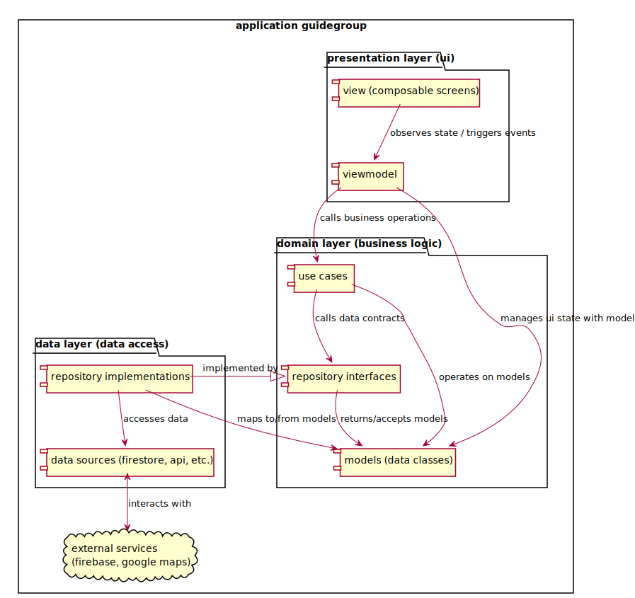

# Architecture Logicielle : MVVM Multicouche et Injection de Dépendances

## Principes de l'architecture MVVM

L'application GuideGroup est bâtie sur l'architecture ****MVVM (Model-View-ViewModel)****, il s'agit d'un pattern de conception qui favorise une séparation claire des responsabilités, rendant le code plus maintenable, testable et évolutif.

### Le \"Model\" (M) : La Couche Données et Domaine

Dans notre implémentation MVVM, le \"Model\" est une couche étendue, englobant tout ce qui n'est ni l'interface utilisateur ni la logique de présentation directe. Elle se divise en deux sous-couches principales :

-   ****Couche Domaine (Domain Layer) :**** C'est le cœur de la logique métier de l'application. Elle contient les ****modèles de données**** (classes Kotlin comme 'User', 'Message', PointOfInterest), les ****Use Cases**** ) et les ****interfaces de Référentiels (Repositories)****.

    -   Les ****Use Cases**** encapsulent des opérations métier spécifiques (ex: SignInUseCase, SendMessageUseCase). Ils orchestrent les interactions avec les Référentiels pour réaliser une tâche métier complète. Ils sont indépendants de l'UI.

    -   Les ****interfaces de Référentiels**** définissent des contrats pour l'accès aux données (ex: AuthRepository, MessageRepository). Elles déclarent **ce que** les données peuvent faire, sans spécifier **comment** elles sont accédées ou stockées.

-   ****Couche Données (Data Layer) :**** Cette couche est responsable de l'implémentation concrète des interfaces de Référentiels définies dans la couche Domaine. Elle gère l'accès réel aux sources de données (bases de données locales, API réseau, services Firebase, etc.). Elle contient les implémentations des Référentiels (ex: AuthRepositoryImpl, MessageRepositoryImpl) et les sources de données qui interagissent directement avec les services externes.

    -   C'est par cette couche que l'application \"sait\" d'où proviennent les données. Le reste de l'application interagit via les interfaces de Référentiels.

### Le \"View\" (V) : L'Interface Utilisateur

La \"View\" est la couche responsable de l'affichage de l'interface utilisateur et de la capture des interactions de l'utilisateur.

-   Dans GuideGroup, la Vue est implémentée avec ****Jetpack Compose****. Il s'agit de fonctions '@Composable' qui décrivent l'UI.

-   La Vue est ****passive**** et \"sans intélligence\" dans le sens où elle ne contient aucune logique métier ou de manipulation de données. Son rôle principal est d'observer l'état exposé par le ViewModel et de déléguer les événements utilisateur au ViewModel.

-   Elle est découplée du Modèle ; elle ne connaît que le ViewModel.

### Le \"ViewModel\" (VM) : Le Pont entre Vue et Modèle

Le \"ViewModel\" agit comme un intermédiaire entre la Vue et le Modèle. C'est le cœur de la logique de présentation.

-   Il expose l'état de l'interface utilisateur sous une forme facilement consommable par la Vue (via des 'StateFlow' en Kotlin).

-   Il reçoit les événements de l'utilisateur de la Vue, traite la logique de présentation (ex: validation d'entrée, gestion des indicateurs de chargement), et appelle les Use Cases de la couche Domaine pour exécuter la logique métier.

-   Le ViewModel est ****indépendant à la Vue****. Il ne contient aucune référence directe à des éléments d'UI Android (Widgets, Composable spécifique). Cela le rend facilement testable en isolation, sans nécessiter d'interface graphique.

## Diagramme Architectural des Couches

Explication du diagramme architectural :

Flèches Pointillées (Dépendance) : indiquent qu'une couche dépend d'une autre. la flèche va du dépendant vers la dépendance. Par exemple, la view dépend du viewmodel.\
Flèche Solide Avec Triangle Creux (Implémentation) : indique qu'une classe implémente une interface. Par exemple repository implementations implémente repository interfaces.\
Flèche Solide Avec Losange (Composition/Agrégation) : non représenté directement ici car c'est un diagramme de couches, mais cela se manifeste au sein des couches (ex: viewmodel contient un use case).
Nuage (Cloud en anglais) : représente les services externes que l'application utilise (firebase, google maps).

## L'injection de dépendances avec hilt

L'injection de dépendances (di : dependency injection) est un principe de conception qui permet de fournir les dépendances d'un objet (autres objets dont il a besoin pour fonctionner) de l'extérieur, plutôt que de le laisser créer ses propres dépendances. Cela favorise le découplage, la testabilité et la flexibilité.

Dans guidegroup, nous utilisons hilt pour l'injection de dépendances sur android.

### Les avantages l'injection dépendance

****Découplage :**** Les classes ne créent pas leurs propres dépendances, elles les déclarent dans leur constructeur et hilt les fournit. Ainsi, un viewmodel ne sait pas comment un signinusecase est créé ; il sait juste qu'il en a besoin.\
****Testabilité :**** Lors des tests unitaires d'un viewmodel, on peut facilement lui fournir des \"faux\" (mocks ou fakes) use cases ou repositories qui simulent différents scénarios (succès, échec, données spécifiques), sans avoir besoin de véritables bases de données ou de connexions réseau.\
****Maintenabilité et évolutivité :**** Si l'on décide de changer l'implémentation d'un service (par exemple, passer de firebase à une autre base de données), seule l'implémentation du référentiel doit être modifiée. Les use cases et viewmodels n'ont pas besoin d'être touchés, car ils dépendent de l'interface et non de l'implémentation concrète.\
**Lisibilité du code :** Le code est plus clair car les dépendances sont explicitement déclarées dans le constructeur.

### annotation dans hilt

Hilt s'intègre au cycle de vie d'android et génère le code nécessaire à l'injection au moment de la compilation.

\@hiltandroidapp : cette annotation déclenche la génération du conteneur de dépendances de l'application.\
\@androidentrypoint : annoter les activités, fragments, vues, services, et broadcast receivers permet à hilt d'y injecter des dépendances.\
\@hiltviewmodel : est une annotation spécifique pour les viewmodels, qui les intègre dans le graphe de dépendances de hilt.\
\@inject : utilisé pour deux raisons principales :

-   sur le constructeur d'une classe (@inject constructor(...)) : indique à hilt comment créer une instance de cette classe en lui fournissant ses dépendances.

-   sur un champ ou une méthode : permet à hilt d'injecter une dépendance dans ce champ ou d'appeler cette méthode pour fournir une dépendance.\

\@module et \@provides : pour les cas où hilt ne peut pas directement \"savoir\" comment construire une dépendance (ex: interfaces, bibliothèques tierces comme firebaseauth). Un \@module est une classe qui fournit des dépendances. Les méthodes annotées avec \@provides à l'intérieur d'un module indiquent à hilt comment créer et fournir une instance d'un certain type.

Dans cet exemple, hilt saura comment fournir des instances de Firebaseauth, Firebasefirestore, Firebasestorage et surtout comment mapper l'interface du repository à son implémentation concrète.

Dans le chapitre 2 nous avons détaillé l'architecture mvvm et le principe d'utilisation de l'injection dépendance de hilt, avec un exemple de module.

Dans le chapitre 3, couvre les diagrammes d'utilisation uml et leurs descriptions détaillées.

**←** [Chapitre 1 : Introduction](chapitre1.md) | [Chapitre 3 : Diagramme de cas d'utilisation](chapitre3.md) **→**