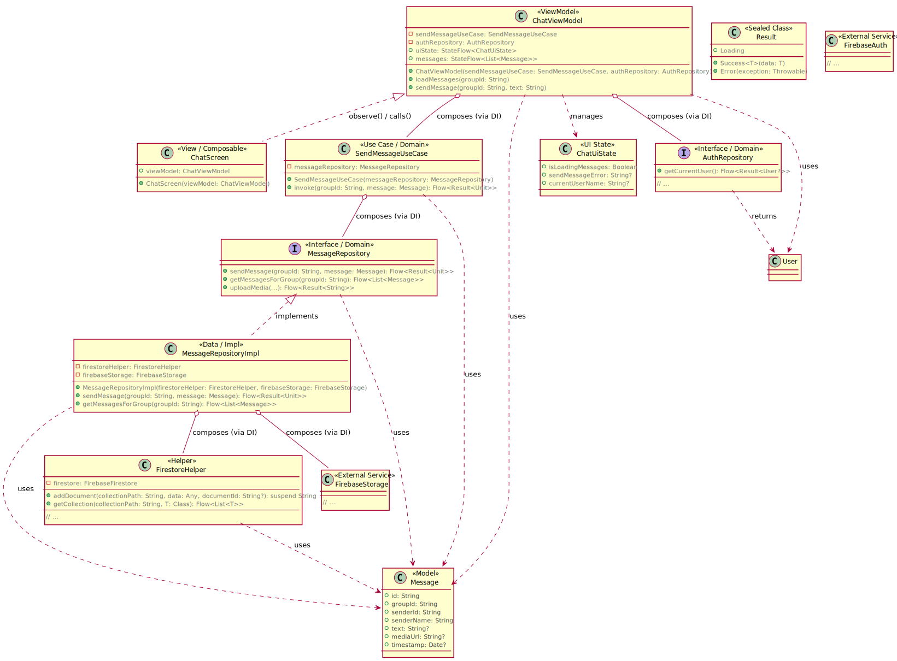
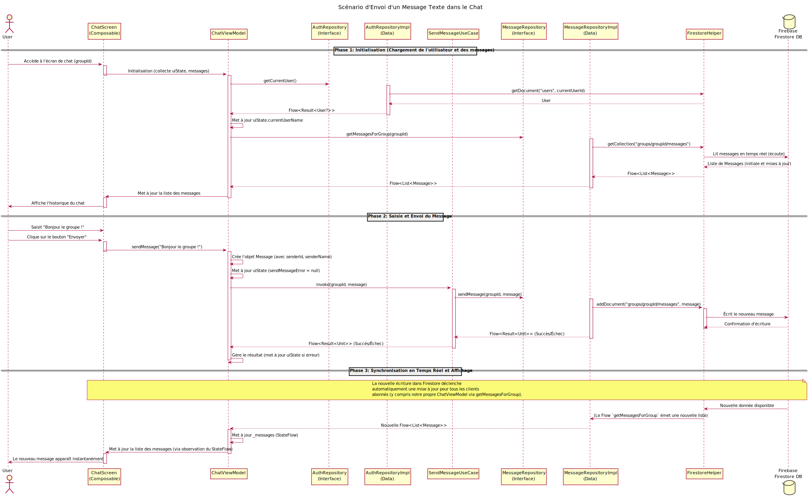

# Scénario envoi d'un message texte dans la messagerie de groupe

Ce chapitre se concentre sur l'une des fonctionnalités de communication clés de GuideGroup : le chat de groupe. Nous allons analyser le flux d'envoi d'un message texte, depuis l'interaction utilisateur jusqu'à la persistance des données et la mise à jour en temps réel de l'UI.

## Présentation du Scénario : Envoi d'un Message Texte

L'envoi d'un message dans le chat de groupe est une interaction dynamique qui implique l'authentification de l'expéditeur, l'enregistrement du message dans une base de données en temps réel (Firebase Firestore) et la diffusion quasi-instantanée à tous les membres du groupe. Ce scénario met en lumière la gestion des événements UI et la propagation des données à travers l'architecture.

## Les Classes Impliquées dans le Scénario d'Envoi de Message

Pour ce scénario, les classes clés à examiner sont :

-   ****'ChatScreen'**** : La ****Vue**** (Composable Jetpack Compose) qui affiche l'interface du chat et gère la saisie de message.

-   ****'ChatViewModel'**** : Le ****ViewModel**** qui gère l'état de l'UI du chat et orchestre l'envoi/la réception des messages.

-   ****'SendMessageUseCase'**** : Un ****UseCase**** de la couche Domaine pour encapsuler la logique d'envoi de message.

-   ****'MessageRepository'**** : L'****interface de Référentiel**** pour les messages, définissant le contrat d'accès aux données.

-   ****'MessageRepositoryImpl'**** : L'****implémentation concrète**** du Référentiel, interagit avec Firebase Firestore et Storage.

-   ****'AuthRepository'**** : L'interface de Référentiel pour l'authentification, utilisée ici pour récupérer l'utilisateur courant (expéditeur).

-   ****'Message'**** : Le ****modèle de données**** représentant un message de chat.

-   ****'User'**** : Le modèle de données de l'utilisateur (pour les infos de l'expéditeur).

-   ****'ChatUiState'**** : Un modèle d'état spécifique à l'UI du chat, exposé par le ViewModel.

-   ****'Result'**** : La classe scellée générique pour la gestion des résultats d'opération.

-   ****'FirestoreHelper'**** : Une classe utilitaire pour interagir avec Firebase Firestore.

-   ****'FirebaseStorage'**** : Le service externe de Firebase pour le stockage de fichiers (pour les médias, bien que ce scénario se concentre sur le texte, la structure de 'MessageRepositoryImpl' l'anticipe).

## Diagramme UML des Classes du Scénario d'Envoi de Message

Ce diagramme UML de classes montre les relations directes entre les composants clés du scénario d'envoi de message.

Explication du Diagramme :

La ChatScreen observe le ChatViewModel.
Le ChatViewModel compose un SendMessageUseCase (pour l'envoi) et un AuthRepository (pour obtenir l'utilisateur courant, l'expéditeur du message).
Le SendMessageUseCase compose le MessageRepository (l'interface).
MessageRepositoryImpl implémente MessageRepository et utilise FirestoreHelper pour écrire les données et potentiellement FirebaseStorage si des médias sont envoyés.
Message est le modèle de données central pour les messages.
ChatUiState et User sont les modèles d'état UI et de données utilisés par le ViewModel.

## Analyse Détaillée des Composants et du Code

### Le Modèle (Couches Domaine et Données)

1.  Message.kt (Modèle de Données)

    Rôle : Représente la structure d'un message de chat. Il inclut des champs pour l'expéditeur, le contenu (texte ou URL média), le type de média et l'horodatage. Ce modèle est indépendant de la source de données et de l'UI.

2.  MessageRepository.kt (Interface du Référentiel de Messages)

    Rôle : Définit les opérations possibles liées aux messages, comme envoyer un message, récupérer tous les messages d'un groupe ou téléverser un média. C'est le contrat de la couche Domaine.

3.  MessageRepositoryImpl.kt (Implémentation du Référentiel de Messages)

    Rôle : L'implémentation concrète de la couche Données. Elle gère l'interaction directe avec Firebase Firestore (pour le texte) et Firebase Storage (pour les médias). Le getMessagesForGroup utilise la capacité de Firestore à émettre des mises à jour en temps réel via un Flow, ce qui est nécessaire pour le chat.

4.  SendMessageUseCase.kt (Use Case d'Envoi de Message)

    Rôle : Ce Use Case, de la couche Domaine, encapsule la logique métier \"Envoyer un message\". Il reçoit le message à envoyer et le délègue au MessageRepository. Il est indépendant à l'UI et à la persistance.

### Le ViewModel (Couche Présentation)

1.  ChatUiState.kt (Modèle d'État UI)

    Rôle : Représente l'état spécifique de l'interface utilisateur de l'écran de chat. Le ChatViewModel met à jour cet état, et la ChatScreen l'observe pour adapter son affichage (par exemple, afficher un indicateur de chargement ou un message d'erreur).

2.  ChatViewModel.kt (ViewModel)

    Rôle : Fait partie de la couche Présentation. Le ChatViewModel est le gestionnaire de la logique de présentation pour l'écran de chat.
    Il expose deux StateFlow : uiState (pour les erreurs, le chargement, etc.) et messages (pour la liste des messages à afficher).
    La méthode loadCurrentUser() récupère les informations de l'utilisateur actuel via AuthRepository pour identifier l'expéditeur des messages.
    La méthode loadMessages() observe un Flow du MessageRepository qui émet les messages en temps réel depuis Firestore. Cela garantit que le chat est toujours à jour pour l'utilisateur.
    La méthode sendMessage() est appelée par la Vue. Elle construit l'objet Message avec les informations de l'expéditeur et le texte, puis délègue l'envoi au SendMessageUseCase.
    Il gère les résultats de l'envoi et met à jour uiState en cas d'erreur.

### La Vue (Couche Présentation)

1.  ChatScreen.kt (Composable Jetpack Compose)

    Rôle : C'est la Vue concrète de l'architecture. Elle fait partie de la couche Présentation.
    Elle est responsable de l'affichage de l'interface utilisateur du chat : la barre de saisie, le bouton d'envoi, et la liste des messages.
    Elle observe les StateFlow (uiState et messages) du ChatViewModel pour que son affichage soit automatiquement mis à jour lorsque de nouveaux messages arrivent ou que l'état de l'UI change (chargement, erreur).
    Elle délègue les interactions utilisateur (clic sur \"Envoyer\") au ChatViewModel via la méthode viewModel.sendMessage().
    Elle ne contient aucune logique métier ni d'accès direct aux données.

## Diagramme de Séquence UML : Scénario d'Envoi d'un Message Texte

Ce diagramme visualise le flux dynamique lors de l'envoi d'un message dans le chat.

Explication Détaillée des Étapes du Diagramme :

**Phase 1: Initialisation**

Utilisateur -\> ChatScreen : L'utilisateur navigue vers l'écran de chat d'un groupe spécifique.\
ChatScreen -\> ChatViewModel : Lors de son initialisation, la ChatScreen commence à observer les StateFlow (uiState et messages) du ChatViewModel.\
ChatViewModel -\> AuthRepository (Interface) : Le ChatViewModel récupère les informations de l'utilisateur courant (ID et nom) via AuthRepository.getCurrentUser() pour marquer les messages de l'expéditeur et les distinguer.\
AuthRepositoryImpl -\> FirestoreHelper -\> Firebase Firestore DB : L'implémentation du référentiel d'authentification accède à Firestore pour récupérer le profil utilisateur.\
Firebase Firestore DB --\> AuthRepositoryImpl --\> ChatViewModel : Le profil utilisateur est renvoyé au ViewModel.\
ChatViewModel -\> ChatViewModel : Le ViewModel met à jour uiState.currentUserName et currentUserId.\
ChatViewModel -\> MessageRepository (Interface) : Le ViewModel initie également le chargement des messages du groupe en appelant MessageRepository.getMessagesForGroup().\
MessageRepositoryImpl -\> FirestoreHelper -\> Firebase Firestore DB : L'implémentation du référentiel de messages établit une écoute en temps réel sur la collection de messages du groupe dans Firestore.\
Firebase Firestore DB --\> FirestoreHelper --\> MessageRepositoryImpl --\> ChatViewModel : Firestore renvoie continuellement des listes de messages mises à jour via un Flow au ViewModel.\
ChatViewModel -\> ChatScreen : Le ViewModel met à jour son \_messages StateFlow, ce qui déclenche la recomposition de la ChatScreen et l'affichage des messages.\
**Phase 2: Saisie et Envoi du Message**

Utilisateur -\> ChatScreen : L'utilisateur saisit son message dans le champ de texte et clique sur le bouton \"Envoyer\".\
ChatScreen -\> ChatViewModel : La ChatScreen appelle ChatViewModel.sendMessage(text) avec le contenu du message\
.
ChatViewModel -\> ChatViewModel : Le ViewModel valide le message (non vide) et crée un objet Message complet avec l'ID et le nom de l'expéditeur récupérés précédemment, ainsi qu'un ID unique généré pour le message. Il met à jour uiState pour effacer toute erreur précédente.\
ChatViewModel -\> SendMessageUseCase : Le ViewModel délègue l'opération d'envoi au SendMessageUseCase.\
SendMessageUseCase -\> MessageRepository (Interface) : Le Use Case appelle MessageRepository.sendMessage() sur l'interface.\
MessageRepositoryImpl -\> FirestoreHelper -\> Firebase Firestore DB : L'implémentation concrète du référentiel utilise FirestoreHelper pour écrire le nouvel objet Message dans la collection Firestore groups/groupId/messages.\
Firebase Firestore DB --\> FirestoreHelper --\> MessageRepositoryImpl --\> SendMessageUseCase --\> ChatViewModel : Le résultat de l'opération d'écriture (succès ou échec) est renvoyé sous forme de Flow\<Result\<Unit\>\> et propagé jusqu'au ViewModel.\
ChatViewModel -\> ChatViewModel : Le ViewModel collecte le Flow et, en cas d'erreur, met à jour uiState.sendMessageError pour l'afficher à l'utilisateur. En cas de succès, aucune action spécifique n'est nécessaire pour mettre à jour la liste des messages, car le mécanisme de synchronisation en temps réel s'en chargera.\
**Phase 3: Synchronisation en Temps Réel et Affichage**

Firebase Firestore DB -\> FirestoreHelper -\> MessageRepositoryImpl : Dès que le nouveau message est écrit dans Firestore, la \"listener\" (écouteur en temps réel) établie par getMessagesForGroup() détecte ce changement et envoie une nouvelle liste de messages mise à jour.
MessageRepositoryImpl --\> ChatViewModel : Le Flow\<List\<Message\>\> émet cette nouvelle liste au ChatViewModel.\
ChatViewModel -\> ChatScreen : Le ChatViewModel met à jour son \_messages StateFlow avec la nouvelle liste, ce qui déclenche la recomposition de la ChatScreen.\
ChatScreen -\> Utilisateur : La ChatScreen se met à jour et le nouveau message apparaît instantanément dans la liste des messages pour l'utilisateur qui l'a envoyé, et pour tous les autres membres du groupe qui regardent également le chat.\
Ce scénario met en évidence tout l'intérêt de l'architecture MVVM combinée à une base de données en temps réel. La Vue est simple, le ViewModel gère la logique de présentation et la coordination, et les couches Domaine/Données s'occupent de la complexité métier et de l'accès aux données.

Le Chapitre 6 traite du scenario de l'ajout d'un Point d'Intérêt sur la Carte.

**←** [Chapitre 4 : Scénario de connexion d'un utilisateur](chapitre4.md) | [Chapitre 6 : scénario d'ajout d'un POI sur la CARTE](chapitre6.md) **→**